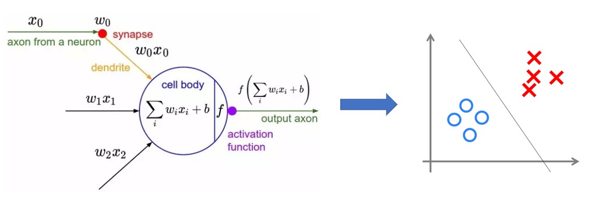
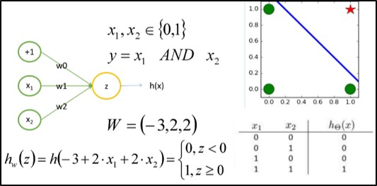

# 前馈神经网络(feedforward neural network)

# 1 相关概念

## 1.1 人工智能是什么

## 1.2 深度学习与人工智能的关系

## 1.3 深度学习的概念
&nbsp;&nbsp;&nbsp;&nbsp;&nbsp;&nbsp;&nbsp;&nbsp;深度学习（英语：deep learning）是机器学习的分支，是一种以人工神经网络为架构，对资料进行表征学习的算法。 

*(注释：在机器学习中，特征学习（feature learning）或表征学习（representation learning）[1]是学习一个特征的技术的集合：将原始数据转换成为能够被机器学习来有效开发的一种形式。它避免了手动提取特征的麻烦，允许计算机学习使用特征的同时，也学习如何提取特征：学习如何学习。）*

&nbsp;&nbsp;&nbsp;&nbsp;&nbsp;&nbsp;&nbsp;&nbsp;深度学习旨在通过构建和训练**多层神经网络**来实现人工智能任务。它模拟了人脑神经元之间的相互连接和信息传递方式，通过学习大量数据来提取特征和模式，并用于分类、识别、预测和决策等任务。 

## 1.4 什么是人工神经网络
&nbsp;&nbsp;&nbsp;&nbsp;&nbsp;&nbsp;&nbsp;&nbsp;人工神经网络（英语：artificial neural network，ANNs）简称神经网络（neural network，NNs）或类神经网络，在机器学习和认知科学领域，是一种模仿生物神经网络（动物的中枢神经系统，特别是大脑）的结构和功能的数学模型或计算模型，用于对函数进行估计或近似。 
&nbsp;&nbsp;&nbsp;&nbsp;&nbsp;&nbsp;&nbsp;&nbsp;神经网络由大量的人工神经元联结进行计算。大多数情况下人工神经网络能在外界信息的基础上改变内部结构，是一种自适应系统，通俗地讲就是具备学习功能。 
&nbsp;&nbsp;&nbsp;&nbsp;&nbsp;&nbsp;&nbsp;&nbsp;现代神经网络是一种**非线性统计性**数据建模工具，神经网络通常是通过一个基于数学统计学类型的学习方法（learning method）得以优化，所以也是数学统计学方法的一种实际应用，通过统计学的标准数学方法我们能够得到大量的可以用函数来表达的局部结构空间，另一方面在人工智能学的人工感知领域，我们通过数学统计学的应用可以来做人工感知方面的决定问题（也就是说通过统计学的方法，人工神经网络能够类似人一样具有简单的决定能力和简单的判断能力），这种方法比起正式的逻辑学推理演算更具有优势。 

## 1.5 前馈神经网络的概念
&nbsp;&nbsp;&nbsp;&nbsp;&nbsp;&nbsp;&nbsp;&nbsp;深度前馈网络（deep feedforward network), 也叫作前馈神经网络（feedforward neural network）或者多层感知机（multilayer perceptron, MLP), 是典型的深度学习模型。  

# 2 神经元模型
## 2.1 M-P 神经元
1943 年，[McCulloch and Pitts, 1943] 将神经元抽象为数学概念上的的简单模型，这就是一直沿用至今的 **M-P 神经元模型：**  

&nbsp;&nbsp;&nbsp;&nbsp;&nbsp;&nbsp;&nbsp;&nbsp;在这个模型中， 神经元接收到来自 $n$ 个其他神经元传递过来的输入信号, 这些输入信号通过带权重的连接(onnection)进行传递，神经元接收到的总输入值(sum)将与神经元的阀值进行比较，然后通过**激活函数(activation function)** 处理以产生神经元的输出。 

## 2.2 经典激活函数
&nbsp;&nbsp;&nbsp;&nbsp;&nbsp;&nbsp;&nbsp;&nbsp;最初的激活函数是下图左所示的阶跃函数，它将输入值映射为输出值 0 或 1, 显然 "1" 对应于神经元兴奋， "0" 对应于神经元抑制. 然而，阶跃函数具有不连续、不光滑等不太好的性质，因此实际常用Sigmoid函数作为激活函数(注释：目前已经有很多更好的激活函数)。 典型的Sigmoid 函数如图下图右所示， 它把可能在较大范围内变化的输入值挤压到(0，1) 输出值范围内，因此有时也称为"挤压函数" (squashing function）。 

# 3 从神经元到感知机
&nbsp;&nbsp;&nbsp;&nbsp;&nbsp;&nbsp;&nbsp;&nbsp;感知机（perceptron）是由两层神经元组成的结构，输入层用于接受外界输入信号，输出层（也被称为是感知机的功能层）就是M-P神经元，亦称“阈值逻辑单元”（threshold logic unit）。感知机的结构如下： 

## 3.1 使用感知机解决线性可分问题
&nbsp;&nbsp;&nbsp;&nbsp;&nbsp;&nbsp;&nbsp;&nbsp;简单来说，如果可以使用一条线将数据集分为两个类别，则称该问题是线性可分的。比如：在一群猫和狗中，将猫分离出来。而非线性可分问题的数据集包含两种以上的类别，所以需要非线性线将它们分成各自的类别。比如：对手写数字的分类，因为它包含了两种以上的类别，所以要使用非线性线将其分类。 
**线性可分与线性不可分**

**数学模型**

## 3.1.1 使用感知机解决与(And) 问题

## 3.1.2 使用感知机解决或(Or) 问题

## 3.1.3 使用感知机解决异非（Not）问题

