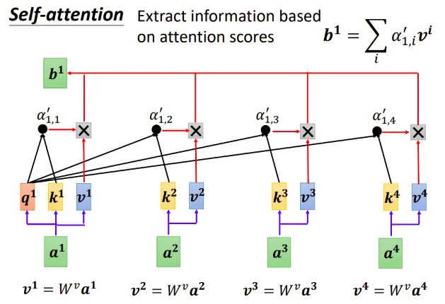
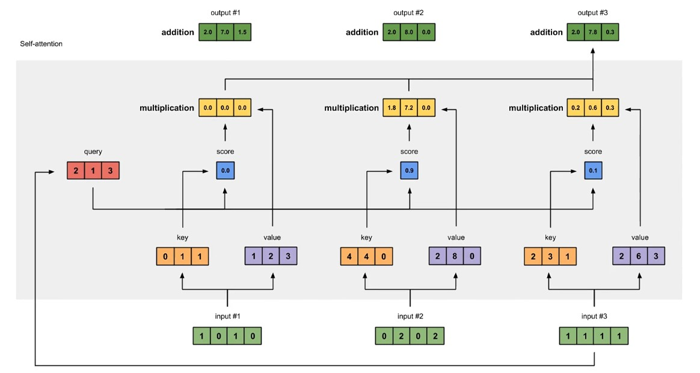
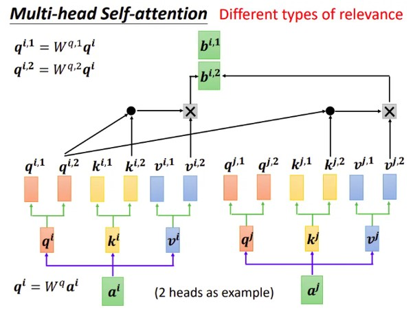
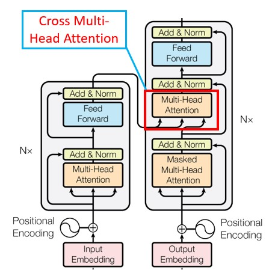

# 1 Attention Is All You Need
- [论文链接](https://arxiv.org/pdf/1706.03762.pdf)

&nbsp;&nbsp;&nbsp;&nbsp;&nbsp;&nbsp;&nbsp;&nbsp;提出了一种新的简单的网络架构Transformer，仅基于attention机制并完全避免循环(RNN)和卷积(Convolution)。<br>

&nbsp;&nbsp;&nbsp;&nbsp;&nbsp;&nbsp;&nbsp;&nbsp;在各种任务中，attention机制已经成为**序列**建模和转导模型不可或缺的一部分，它可以建模依赖关系而不考虑其在输入或输出序列中的距离。 除少数情况外，这种attention机制都与循环网络一起使用。<br>

&nbsp;&nbsp;&nbsp;&nbsp;&nbsp;&nbsp;&nbsp;&nbsp;在这项工作中论文提出Transformer，这种模型架构避免循环并完全依赖于attention机制来绘制输入和输出之间的全局依赖关系。 Transformer允许进行更多的并行化，并且可以在八个P100 GPU上接受少至十二小时的训练后达到翻译质量的新的最佳结果。<br>

&nbsp;&nbsp;&nbsp;&nbsp;&nbsp;&nbsp;&nbsp;&nbsp;Self-attention，有时称为intra-attention，是一种attention机制，它关联单个序列的不同位置以计算序列的表示。<br>

&nbsp;&nbsp;&nbsp;&nbsp;&nbsp;&nbsp;&nbsp;&nbsp;Transformer是第一个完全依靠self-attention来计算输入和输出表示而不使用序列对齐RNN或卷积的转导模型。Transformer 模型一经推出便取得 各项NLP 任务 的SOTA 效果，之后更是蔓延到了vision 领域等其他领域，呈现一发不可收的迹象。因此有必要对Transformer模型有一个全面认识。<br>

# 2 Transformer Model Architecture


&nbsp;&nbsp;&nbsp;&nbsp;&nbsp;&nbsp;&nbsp;&nbsp;大部分神经序列转导模型都有一个编码器-解码器结构。 这里，编码器映射一个用符号表示的输入序列 $(x_{1}, \dots, x_{n})$ 到一个连续的表示 $z = (z_{1}, \dots, z_{n})$ 。 根据z，解码器生成符号的一个输出序列 $(y_{1}, \dots, y_{m})$ ，一次一个元素。 在每一步中，模型都是自回归的，当生成下一个时，使用先前生成的符号作为附加输入。<br>

&nbsp;&nbsp;&nbsp;&nbsp;&nbsp;&nbsp;&nbsp;&nbsp;Transformer遵循这种整体架构，编码器和解码器都使用self-attention堆叠和point-wise、完全连接的层，分别显示在上图的左边和右边。<br>

# 3 编码器和解码器堆栈
## 3.1 编码器：
&nbsp;&nbsp;&nbsp;&nbsp;&nbsp;&nbsp;&nbsp;&nbsp;编码器由N = 6 个完全相同的层堆叠而成。 每一层都有两个子层。 第一个子层是一个multi-head self-attention机制，第二个子层是一个简单的、位置完全连接的前馈网络。 我们对每个子层再采用一个残差连接，接着进行层标准化。也就是说，每个子层的输出是LayerNorm(x + Sublayer(x))，其中Sublayer(x) 是由子层本身实现的函数。 为了方便这些残差连接，模型中的所有子层以及嵌入层产生的输出维度都为dmodel = 512。<br>

## 3.2 解码器：
&nbsp;&nbsp;&nbsp;&nbsp;&nbsp;&nbsp;&nbsp;&nbsp;解码器同样由N = 6 个完全相同的层堆叠而成。 除了每个编码器层中的两个子层之外，解码器还插入第三个子层，该层对编码器堆栈的输出执行multi-head attention。 与编码器类似，我们在每个子层再采用残差连接，然后进行层标准化。 我们还修改解码器堆栈中的self-attention子层，以防止位置关注到后面的位置。 这种掩码结合将输出嵌入偏移一个位置，确保对位置的预测 i 只能依赖小于i 的已知输出。<br>

# 4 Scaled Dot-Product Attention（缩放版本的点积注意力）
&nbsp;&nbsp;&nbsp;&nbsp;&nbsp;&nbsp;&nbsp;&nbsp;Attention可以描述为将query和一组 **key-value对** 映射到输出(output)，其中query、key、value和 output都是向量(vector)。 输出为value的加权和，其中分配给每个value的权重通过query与相应key的兼容函数来计算。

## 4.1 模型结构图


## 4.2 数学公式为
$$Attention(Q, K, V)=softmax(\frac{Q K^{T}}{\sqrt{d_{k}}}) V $$

## 4.3 推导过程详解
### 4.2.1 self attention 的思想


&nbsp;&nbsp;&nbsp;&nbsp;&nbsp;&nbsp;&nbsp;&nbsp;每个Self-attention的输出，都是考虑了所有的输入向量才生成出来的, 如上图所示。需要注意的是这些向量可能是整个网络的输入，也可能是某个隐藏层的输出<br>

### 4.2.2 自注意的思想 


**思考：如何找到两个向量间的相关性** <br>

- 向量相关性1：Additive** <br>


- 向量相关性2：Dot Product** <br>


&nbsp;&nbsp;&nbsp;&nbsp;&nbsp;&nbsp;&nbsp;&nbsp;在实践中Dot-Product 的速度更快、更节省空间，因为它可以使用高度优化的矩阵乘法代码来实现。<br>

### 4.2.3 自注意机制运算过程
- 单个 token 权重系数的计算 <br>


- 第一步、计算权重系数：每个Token对其他Token做向量点乘，这里的向量点乘并不是说 $\alpha_1$ 向量直接乘以 $\alpha_2$ 向量，而是每个向量先拆分成Q、K、V三个矩阵，经过线性变换(如图中乘以一个权重 $w^q$ 、 $w^k$ 、 $w^v$ )形成 $q^1$ 、 $k^1$ 、 $v^1$ 三个向量也就是说每个Token对应三个向量，比如图中的 $\alpha_1$ 向量分别对应 $q^1$ 、 $k^1$ 、 $v^1$ 三个向量， $\alpha_2$ 向量分别对应 $q^2$ 、 $k^2$ 、 $v^2$ 三个向量，以此类推...
- 第二步、计算系数：第一个Token的query去询问其他Token的key得到的这个系数，比如 $\alpha_1$  Token的 $q^1$ 乘以它自己本身的 $k^1$ 得到 $\alpha_{1,1}$ 系数($q^1$ * $k^1$ = $\alpha_{1,1}$)、 $q^1$ * $k^2$得到 $\alpha_{1,2}$ 、 $q^1$ * $k^3$ 得到 $\alpha_{1,3}$ 、 $q^1$ * $k^4$得到  $\alpha_{1,4}$，这样一来就得到了四个系数，这个四个系数还要除以 $\sqrt{d_k}$的缩放操作（图中没有画出来），然后再经过softmax得到图中最上方的系数 $\alpha_{1,1}'$、 $\alpha_{1,2}'$、 $\alpha_{1,3}'$、 $\alpha_{1,4}'$（四个标量），这些系数加起来 = 1<br>
- $q^1$ * $k^1$ = $\alpha_{1,1}$<br>$q^1$ * $k^2$ = $\alpha_{1,2}$<br>$q^1$ * $k^3$ = $\alpha_{1,3}$<br>$q^1$ * $k^4$ = $\alpha_{1,4}$<br>$\alpha_{1,1}'$ + $\alpha_{1,2}'$ + $\alpha_{1,3}'$ + $\alpha_{1,4}'$ = 1

- 输入 token 对应的输出的计算 <br>


- 第三步、计算value $b^1$： $\alpha_{1,1}'$、 $\alpha_{1,2}'$、 $\alpha_{1,3}'$、 $\alpha_{1,4}'$ 这些系数分别与 $\alpha_1$ Token的value( $v^1$)、 $\alpha_2$ Token的value( $v^2$)、 $\alpha_3$ Token的value( $v^3$)、 $\alpha_4$ Token的value( $v^4$)相乘，分别得到四个新的向量，再将这四个向量加起来就得到了 $b^1$ <br>
  $b^1$ = $\alpha_{1,1}'$ *  $v^1$  + $\alpha_{1,2}'$ *  $v^2$  + $\alpha_{1,3}'$ *  $v^3$  + $\alpha_{1,4}'$ *  $v^4$

- 其它 token 对应的输出的计算 <br>


- 假设输入的形状是(batch_size, seq_len, embed_dim)，batch_size表示几个句子，seq_len表示句子的长度，embed_dim表示维度（常用值为 128、256、300、512）
- 在工程上， $\alpha_1$ 、 $\alpha_2$ 、 $\alpha_3$ 、 $\alpha_4$ 虽说是四个Token，但是通常放到一个Tensor里面来表示四个Token，seq_len这个维度表示 $\alpha_1$ 、 $\alpha_2$ 、 $\alpha_3$ 、 $\alpha_4$  、...、 $\alpha_n$ 
- 一个Tensor怎么操作才高效呢？统一的乘以一个 $w^q$ 矩阵，就会得到 
$\begin{bmatrix}
 q^1 \\
 q^2 \\
 q^3 \\
 q^4 \\
 . \\
 q^n
\end{bmatrix}$ 
这个矩阵，同样的乘以一个 $w^k$ 、 $w^v$ 矩阵，分别得到 
$\begin{bmatrix}
 k^1 \\
 k^2 \\
 k^3 \\
 k^4 \\
 . \\
 k^n
\end{bmatrix}$、
$\begin{bmatrix}
 v^1 \\
 v^2 \\
 v^3 \\
 v^4 \\
 . \\
 v^n
\end{bmatrix} $ 这两个矩阵

- 真实数据举例


### 4.2.4 写成矩阵的形式
- 矩阵化 Q K V 的获取过程：<br>


- attention score 的获取写成矩阵形式 <br>


**得到的矩阵我们称之为 Attenion Matrix.**

- Value 加权平均过程 写成矩阵形式 <br>


- 最后，我们将整个过程表达为矩阵形式 <br>


## 4.4 为什么要进行缩放
&nbsp;&nbsp;&nbsp;&nbsp;&nbsp;&nbsp;&nbsp;&nbsp;当 $d_{k}$ 的值比较小的时候，两种点积机制(additive 和 Dot-Product)的性能相差相近，当 $d_{k}$ 比较大时，additive attention 比不带scale 的点积attention性能好。 我们怀疑，对于很大的 $d_{k}$ 值，点积大幅度增长，将softmax函数推向具有极小梯度的区域。 为了抵消这种影响，我们缩小点积 $\frac{1}{\sqrt{d_{k}}}$ 倍。<br>
&nbsp;&nbsp;&nbsp;&nbsp;&nbsp;&nbsp;&nbsp;&nbsp;简单来讲，缩放是为了防止点积结果过大导致梯度消失的问题，而嵌入维度 $d_{k}$ 作为缩放因子是因为点积的方差随维度增加而增大，缩放可以稳定训练

# 5 Multi-Head self Attention
## 5.1 原理简介
&nbsp;&nbsp;&nbsp;&nbsp;&nbsp;&nbsp;&nbsp;&nbsp;论文提出将query、key和value分别用不同的、学到的线性映射(其实就是Linear) 映射到 h 倍 到 $d_{q}$ 、 $d_{k}$ 和 $d_{v}$ 维效果更好，而不是用 $d_{model}$ 维的query、key和value执行单个attention函数。 基于每个映射版本（就是每个头/每个组）的query、key和value，我们并行执行attention函数，产生 $d_v$ 维输出值。 将它们连接(concat)并再次映射（linear)，产生最终值，如下图所示。<br>


## 5.2 公式表达

$$MultiHead(Q, K, V) = Concat(head_{1}, \ldots, head_{h}) W^{O} $$

$$where head_{i} = Attention(Q W_{i}^{Q}, K W_{i}^{K}, V W_{i}^{V})$$

其中： $W_{i}^{Q} \in \mathbb{R}^{d_{model} \times d_{k}}; W_{i}^{K} \in \mathbb{R}^{d_{model} \times d_{k}}; W_{i}^{V} \in \mathbb{R}^{d_{model} \times d_{v}}; W^{O} \in \mathbb{R}^{hd_{v} \times d_{model}};$

**思考：为什么多头效果更好呢？？？**

## 5.3 底层原理
&nbsp;&nbsp;&nbsp;&nbsp;&nbsp;&nbsp;&nbsp;&nbsp;Multi-head attention允许模型的不同表示子空间联合**关注不同位置**的信息。 如果只有一个attention head，它的平均值会削弱这个信息。<br>

## 5.4 多头的实现细节展示




写成矩阵形式参考Dot-Product形式。<br>

# 6 实际工程上的 Multi-Head Attention 详解
- 模型下载： <br>
[encoder-shaped-model](images/encoder_shaped.onnx)

- 用netron打开查看: <br>
[netron](https://netron.app/)

# 7 Cross Multi-Head Attention
&nbsp;&nbsp;&nbsp;&nbsp;&nbsp;&nbsp;&nbsp;&nbsp;首先，Self- Attention与传统的Attention机制非常的不同：传统的Attention是基于source端和target端的隐变量（hidden state）计算Attention的，得到的结果是源端（source端）的每个词与目标端（target端）每个词之间的依赖关系。<br>
&nbsp;&nbsp;&nbsp;&nbsp;&nbsp;&nbsp;&nbsp;&nbsp;其次，Self-Attention首先分别在source端和target端进行自身的attention，仅与source input或者target input自身相关的Self -Attention，以捕捉source端或target端自身的词与词之间的依赖关系；然后再把source端的得到的self -Attention加入到target端得到的Attention中，称作为**Cross-Attention**，以捕捉source端和target端词与词之间的依赖关系。如下图的架构：<br>



# 8 Mask Multi-Head Attention
&nbsp;&nbsp;&nbsp;&nbsp;&nbsp;&nbsp;&nbsp;&nbsp;与Encoder的Multi-Head Attention计算原理一样，只是多加了一个mask码。mask 表示掩码，它对某些值进行掩盖，使其在参数更新时不产生效果。Transformer 模型里面涉及两种 mask，分别是 padding mask 和 sequence mask。<br>

**思考：为什么需要添加这两种mask码呢？？？** <br>

## 8.1 padding mask
&nbsp;&nbsp;&nbsp;&nbsp;&nbsp;&nbsp;&nbsp;&nbsp;什么是 padding mask 呢？因为每个批次输入序列长度是不一样的也就是说，我们要对输入序列进行对齐。具体来说，就是给在较短的序列后面填充 0。但是如果输入的序列太长，则是截取左边的内容，把多余的直接舍弃。因为这些填充的位置，其实是没什么意义的，所以我们的attention机制不应该把注意力放在这些位置上，所以我们需要进行一些处理。<br>

&nbsp;&nbsp;&nbsp;&nbsp;&nbsp;&nbsp;&nbsp;&nbsp;具体的做法是，把**这些位置**的值**加上一个非常大的负数(负无穷)**，这样的话，经过 softmax，这些位置的概率就会接近0！<br>

**思考：上句中的 "这些位置" 指哪些位置呢？** <br>

- pytorch 代码实现
```python
def attention(query, key, value, mask=None, dropout=None):
    "Compute 'Scaled Dot Product Attention'"
    d_k = query.size(-1)
    scores = torch.matmul(query, key.transpose(-2, -1)) / math.sqrt(d_k)
    if mask is not None:
        scores = scores.masked_fill(mask == 0, -1e9) # mask步骤，用 -1e9 代表负无穷
    p_attn = F.softmax(scores, dim = -1)
    if dropout is not None:
        p_attn = dropout(p_attn)
    return torch.matmul(p_attn, value), p_attn
```

## 8.2 sequence mask


&nbsp;&nbsp;&nbsp;&nbsp;&nbsp;&nbsp;&nbsp;&nbsp;sequence mask 是为了使得 decoder 不能看见未来的信息。对于一个序列，在 time_step 为 t 的时刻，我们的解码输出应该只能依赖于 t 时刻之前的输出，而不能依赖 t 之后的输出。因此我们需要想一个办法，把 t 之后的信息给隐藏起来。这在训练的时候有效(推理时候也有效)，因为训练的时候每次我们是将target数据完整输入进decoder中地，预测时不需要，预测的时候我们只能得到前一时刻预测出的输出。<br>


&nbsp;&nbsp;&nbsp;&nbsp;&nbsp;&nbsp;&nbsp;&nbsp;那么具体怎么做呢？也很简单：产生一个上三角矩阵，上三角的值全为0。把这个矩阵作用在每一个序列上，就可以达到我们的目的。<br>

**思考：decoder 中需要 padding mask 吗？** <br>

# 9 MQA（Multi Query Attention）
- 背景：<br>
&nbsp;&nbsp;&nbsp;&nbsp;&nbsp;&nbsp;&nbsp;&nbsp;MQA（Multi Query Attention）最早是出现在2019年谷歌的一篇论文 《Fast Transformer Decoding: One Write-Head is All You Need》，之所以没有被关注到，是因为文本生成类任务还没这么火热，解码序列长度也没有现阶段大模型的要求那么高。<br>

- 核心思想：<br>
&nbsp;&nbsp;&nbsp;&nbsp;&nbsp;&nbsp;&nbsp;&nbsp;MQA 让所有的头之间 共享 同一份 Key 和 Value 矩阵，每个头只单独保留了一份 Query 参数，从而大大减少 Key 和 Value 矩阵的参数量。(Multi-query attention is identical except that the different heads share a single set of keys and values.) <br>

- 图示：<br>


- 效果：<br>
&nbsp;&nbsp;&nbsp;&nbsp;&nbsp;&nbsp;&nbsp;&nbsp;推理速度上生成一个 token 时 MHA 和 MQA 的 encoder 分别耗时1.7us和1.5us，而 decoder 分别46us和3.8us，说明 decoder 上 MQA 比 MHA 快很多。另外在效果上 MQA 的 PPL (越小越好)有所上升，BLEU(越大越好)有所下降，换句话说就是效果有所下降。<br>

[MQA 论文](https://arxiv.org/abs/1911.02150)

# 10 大模型神器：GQA（Grouped Query Attention）
## 10.1 GQA Structure
&nbsp;&nbsp;&nbsp;&nbsp;&nbsp;&nbsp;&nbsp;&nbsp;分组查询注意力(GQA)将查询头分成G个组，每个组共享一个键头和值头。GQA-G表示具有G个组的分组查询。GQA-1表示单个组，因此具有单个键头和值头，等效于MQA。而GQA-H表示组数等于头数，等效于MHA。下图显示了分组查询注意力和多头/多查询注意力的比较。在将多头检查点转换为GQA检查点时，我们通过对该组内所有原始头进行平均汇总来构建每个组的键头和值头。<br>


&nbsp;&nbsp;&nbsp;&nbsp;&nbsp;&nbsp;&nbsp;&nbsp;中间数量的组导致插值模型，其质量高于MQA但比MHA快，正如我们将展示的那样，这代表了一个有利的权衡。从MHA转换为MQA将H个键和值头减少为单个键和值头，将键值缓存(KV Cache)的大小减小，并且需要加载的数据量减少了H倍。然而，更大的模型通常会按比例增加头的数量，从而多查询注意力在内存带宽和容量上都具有更激进的削减。GQA使我们能够随着模型的增大而保持带宽和容量的相同比例减少。<br>
&nbsp;&nbsp;&nbsp;&nbsp;&nbsp;&nbsp;&nbsp;&nbsp;此外，较大的模型相对较少受到注意力的内存带宽开销的影响，因为KV Cache 随着模型维度的增加而扩展，而模型的FLOPs和参数随着模型维度的平方增加。最后，针对大型模型的标准分片将单个键头和值头复制了模型分区的数量（Pope等人，2022）；GQA消除了这种分区的浪费。因此，我们希望GQA在较大的模型中能够达到一个特别好的权衡。<br>
&nbsp;&nbsp;&nbsp;&nbsp;&nbsp;&nbsp;&nbsp;&nbsp;值得注意的是，GQA不适用于编码器(encoder)的自注意力层；编码器表示是并行计算的，因此内存带宽通常不是主要瓶颈。<br>

- [GQA 论文](https://arxiv.org/pdf/2305.13245.pdf)

# 10.2 精度改进：converting the checkpoint and uptraining
*(**uptraining** 是指对已有的模型进行进一步的训练(pre-train)或微调(fine-tune)。它可以是为了适应新的任务或结构，或者改进模型的性能。在这里， **uptraining** 是指将具有多头注意力的语言模型转换为具有多查询注意力的模型，并通过额外的预训练阶段来适应新的结构。)* <br>

- 概念 <br>
&nbsp;&nbsp;&nbsp;&nbsp;&nbsp;&nbsp;&nbsp;&nbsp;在 Multi-Query Attention 方法中只会保留一个单独的key-value头，这样虽然可以提升推理的速度，但是会带来精度上的损失。《Multi-Head Attention:Collaborate Instead of Concatenate 》这篇论文的第一个思路是基于多个 MQA 的 checkpoint 进行 finetuning，来得到了一个质量更高的 MQA 模型。这个过程也被称为 Uptraining。<br>

从多头模型生成多查询模型分为两个步骤：
- 首先是转换检查点(checkpoint)，将多头检查点转换为多查询检查点。key和value头的投影矩阵被平均汇总为单个投影矩阵，我们发现这比选择单个键和值头或从头开始随机初始化新的键和值头效果更好。
- 转换后的检查点接着使用相同的预训练方法进行预训练，但仅进行原始训练步骤的一小部分α。

- 图示：<br>


- 论文链接：<br>
[GQA 论文](https://arxiv.org/pdf/2305.13245.pdf) <br>


# 11 参考链接
- [参考链接](https://towardsdatascience.com/attn-illustrated-attention-5ec4ad276ee3)
- [书籍 + 代码](https://zh-v2.d2l.ai/chapter_attention-mechanisms/attention-scoring-functions.html)
- [read paper](https://readpaper.com/paper/2963403868)
