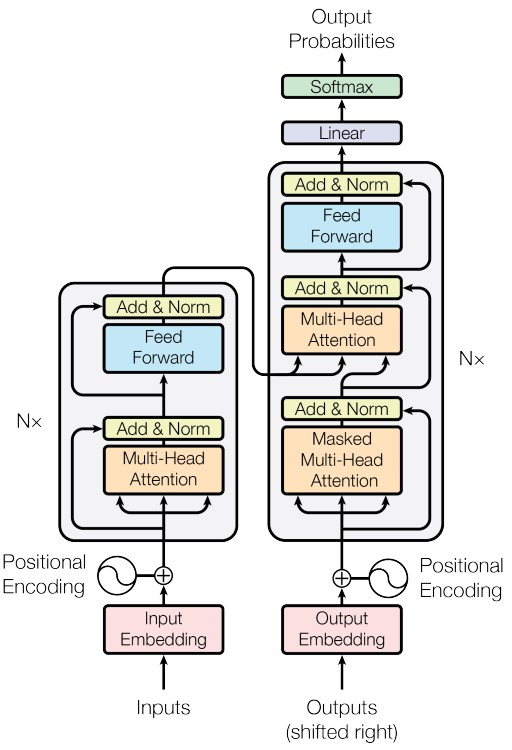
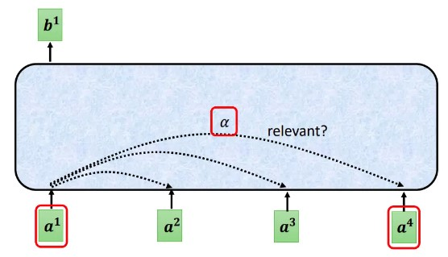
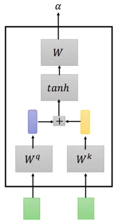
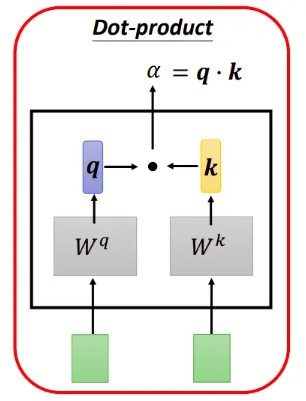
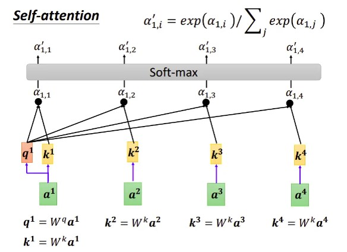
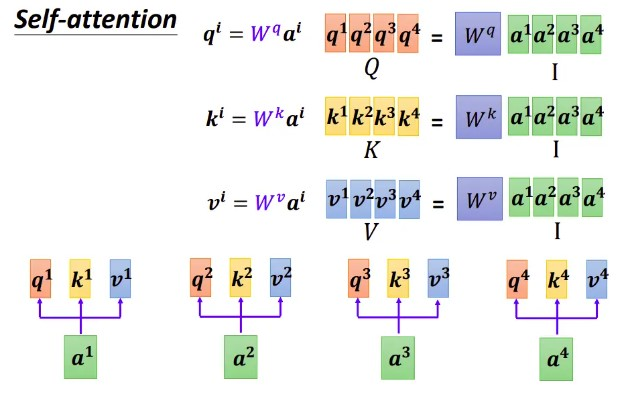
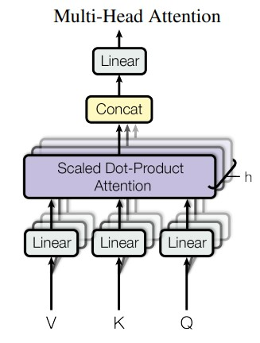
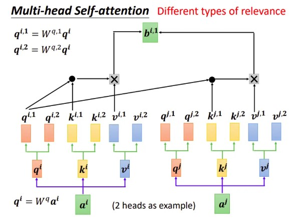

# 1 Attention Is All You Need
- [论文链接](https://arxiv.org/pdf/1706.03762.pdf)
- [中文翻译](https://yiyibooks.cn/yiyibooks/Attention_Is_All_You_Need/index.html)

&nbsp;&nbsp;&nbsp;&nbsp;&nbsp;&nbsp;&nbsp;&nbsp;提出了一种新的简单的网络架构Transformer，仅基于attention机制并完全避免循环(RNN)和卷积(Convolution)。 

&nbsp;&nbsp;&nbsp;&nbsp;&nbsp;&nbsp;&nbsp;&nbsp;在各种任务中，attention机制已经成为**序列**建模和转导模型不可或缺的一部分，它可以建模依赖关系而不考虑其在输入或输出序列中的距离。 除少数情况外，这种attention机制都与循环网络一起使用。 

&nbsp;&nbsp;&nbsp;&nbsp;&nbsp;&nbsp;&nbsp;&nbsp;在这项工作中论文提出Transformer，这种模型架构避免循环并完全依赖于attention机制来绘制输入和输出之间的全局依赖关系。 Transformer允许进行更多的并行化，并且可以在八个P100 GPU上接受少至十二小时的训练后达到翻译质量的新的最佳结果。 

&nbsp;&nbsp;&nbsp;&nbsp;&nbsp;&nbsp;&nbsp;&nbsp;Self-attention，有时称为intra-attention，是一种attention机制，它关联单个序列的不同位置以计算序列的表示。 

&nbsp;&nbsp;&nbsp;&nbsp;&nbsp;&nbsp;&nbsp;&nbsp;Transformer是第一个完全依靠self-attention来计算输入和输出表示而不使用序列对齐RNN或卷积的转导模型。Transformer 模型一经推出便取得 各项NLP 任务 的SOTA 效果，之后更是蔓延到了vision 领域等其他领域，呈现一发不可收的迹象。因此有必要对Transformer模型有一个全面认识。 

# 2 Transformer Model Architecture

&nbsp;&nbsp;&nbsp;&nbsp;&nbsp;&nbsp;&nbsp;&nbsp;大部分神经序列转导模型都有一个编码器-解码器结构。 这里，编码器映射一个用符号表示的输入序列 $(x_{1}, \dots, x_{n})$ 到一个连续的表示 $z = (z_{1}, \dots, z_{n})$ 。 根据z，解码器生成符号的一个输出序列 $(y_{1}, \dots, y_{m})$ ，一次一个元素。 在每一步中，模型都是自回归的，当生成下一个时，使用先前生成的符号作为附加输入。 

&nbsp;&nbsp;&nbsp;&nbsp;&nbsp;&nbsp;&nbsp;&nbsp;Transformer遵循这种整体架构，编码器和解码器都使用self-attention堆叠和point-wise、完全连接的层，分别显示在上图的左边和右边。 

# 3 编码器和解码器堆栈
## 3.1 编码器：
&nbsp;&nbsp;&nbsp;&nbsp;&nbsp;&nbsp;&nbsp;&nbsp;编码器由N = 6 个完全相同的层堆叠而成。 每一层都有两个子层。 第一个子层是一个multi-head self-attention机制，第二个子层是一个简单的、位置完全连接的前馈网络。 我们对每个子层再采用一个残差连接，接着进行层标准化。也就是说，每个子层的输出是LayerNorm(x + Sublayer(x))，其中Sublayer(x) 是由子层本身实现的函数。 为了方便这些残差连接，模型中的所有子层以及嵌入层产生的输出维度都为dmodel = 512。 

## 3.2 解码器：
&nbsp;&nbsp;&nbsp;&nbsp;&nbsp;&nbsp;&nbsp;&nbsp;解码器同样由N = 6 个完全相同的层堆叠而成。 除了每个编码器层中的两个子层之外，解码器还插入第三个子层，该层对编码器堆栈的输出执行multi-head attention。 与编码器类似，我们在每个子层再采用残差连接，然后进行层标准化。 我们还修改解码器堆栈中的self-attention子层，以防止位置关注到后面的位置。 这种掩码结合将输出嵌入偏移一个位置，确保对位置的预测 i 只能依赖小于i 的已知输出。 

# 4 Scaled Dot-Product Attention（缩放版本的点积注意力）
&nbsp;&nbsp;&nbsp;&nbsp;&nbsp;&nbsp;&nbsp;&nbsp;Attention可以描述为将query和一组 **key-value对** 映射到输出(output)，其中query、key、value和 output都是向量(vector)。 输出为value的加权和，其中分配给每个value的权重通过query与相应key的兼容函数来计算。

## 4.1 模型结构图

## 4.2 数学公式为
$$Attention(Q, K, V)=softmax(\frac{Q K^{T}}{\sqrt{d_{k}}}) V $$

## 4.3 推导过程详解
### 4.2.1 self attention 的思想

&nbsp;&nbsp;&nbsp;&nbsp;&nbsp;&nbsp;&nbsp;&nbsp;每个Self-attention的输出，都是考虑了所有的输入向量才生成出来的, 如上图所示。需要注意的是这些向量可能是整个网络的输入，也可能是某个隐藏层的输出 

### 4.2.2 自注意的思想 

**思考：如何找到两个向量间的相关性**  

- 向量相关性1：Additive**  

- 向量相关性2：Dot Product**  

&nbsp;&nbsp;&nbsp;&nbsp;&nbsp;&nbsp;&nbsp;&nbsp;在实践中Dot-Product 的速度更快、更节省空间，因为它可以使用高度优化的矩阵乘法代码来实现。 

### 4.2.3 自注意机制运算过程
- 单个 token 权重系数的计算  

- 输入 token 对应的输出的计算  

- 其它 token 对应的输出的计算  

### 4.2.4 写成矩阵的形式
- 矩阵化 Q K V 的获取过程： 

- attention score 的获取写成矩阵形式  

**得到的矩阵我们称之为 Attenion Matrix.**

- Value 加权平均过程 写成矩阵形式  

- 最后，我们将整个过程表达为矩阵形式  

## 4.4 为什么要进行缩放
&nbsp;&nbsp;&nbsp;&nbsp;&nbsp;&nbsp;&nbsp;&nbsp;当 $d_{k}$ 的值比较小的时候，两种点击机制(additive 和 Dot-Product)的性能相差相近，当 $d_{k}$ 比较大时，additive attention 比不带scale 的点积attention性能好。 我们怀疑，对于很大的 $d_{k}$ 值，点积大幅度增长，将softmax函数推向具有极小梯度的区域。 为了抵消这种影响，我们缩小点积 $\frac{1}{\sqrt{d_{k}}}$ 倍。 

# 5 Multi-Head self Attention
## 5.1 原理简介
&nbsp;&nbsp;&nbsp;&nbsp;&nbsp;&nbsp;&nbsp;&nbsp;论文提出将query、key和value分别用不同的、学到的线性映射 h倍 到 $d_{k}$ 、 $d_{k}$ 和 $d_{v}$ 维效果更好，而不是用 $d_model$ 维的query、key和value执行单个attention函数。 基于每个映射版本的query、key和value，我们并行执行attention函数，产生 $d_v$ 维输出值。 将它们连接并再次映射，产生最终值，如下图所示。 

## 5.2 公式表达

$$MultiHead(Q, K, V) = Concat(head_{1}, \ldots, head_{h}) W^{O} $$

$$where head_{i} = Attention(Q W_{i}^{Q}, K W_{i}^{K}, V W_{i}^{V})$$

其中： $W_{i}^{Q} \in \mathbb{R}^{d_{model} \times d_{k}}; W_{i}^{K} \in \mathbb{R}^{d_{model} \times d_{k}}; W_{i}^{V} \in \mathbb{R}^{d_{model} \times d_{v}}; W^{O} \in \mathbb{R}^{hd_{v} \times d_{model}};$

**思考：为什么多头效果更好呢？？？**

## 5.3 底层原理
&nbsp;&nbsp;&nbsp;&nbsp;&nbsp;&nbsp;&nbsp;&nbsp;Multi-head attention允许模型的不同表示子空间联合**关注不同位置**的信息。 如果只有一个attention head，它的平均值会削弱这个信息。 

## 5.4 多头的实现细节展示

写成矩阵形式参考Dot-Product形式。 

# 6 实际工程上的 Multi-Head Attention 详解

# 6 Cross Multi-Head Attention
&nbsp;&nbsp;&nbsp;&nbsp;&nbsp;&nbsp;&nbsp;&nbsp;首先，Self- Attention与传统的Attention机制非常的不同：传统的Attention是基于source端和target端的隐变量（hidden state）计算Attention的，得到的结果是源端（source端）的每个词与目标端（target端）每个词之间的依赖关系。 
&nbsp;&nbsp;&nbsp;&nbsp;&nbsp;&nbsp;&nbsp;&nbsp;其次，Self-Attention首先分别在source端和target端进行自身的attention，仅与source input或者target input自身相关的Self -Attention，以捕捉source端或target端自身的词与词之间的依赖关系；然后再把source端的得到的self -Attention加入到target端得到的Attention中，称作为**Cross-Attention**，以捕捉source端和target端词与词之间的依赖关系。如下图的架构： 

# 7 MQA（Multi Query Attention）
&nbsp;&nbsp;&nbsp;&nbsp;&nbsp;&nbsp;&nbsp;&nbsp;MQA（Multi Query Attention）最早是出现在2019年谷歌的一篇论文 《Fast Transformer Decoding: One Write-Head is All You Need》，之所以没有被关注到，是因为文本生成类任务还没这么火热，解码序列长度也没有现阶段大模型的要求那么高。 

- [MQA 论文](https://arxiv.org/abs/1911.02150)

&nbsp;&nbsp;&nbsp;&nbsp;&nbsp;&nbsp;&nbsp;&nbsp;如上对比，在 Multi-Query Attention 方法中只会保留一个单独的key-value头，这样虽然可以提升推理的速度，但是会带来精度上的损失。《Multi-Head Attention:Collaborate Instead of Concatenate 》这篇论文的第一个思路是基于多个 MQA 的 checkpoint 进行 finetuning，来得到了一个质量更高的 MQA 模型。这个过程也被称为 Uptraining。 

- [MQA update](https://arxiv.org/pdf/2006.16362.pdf)

# 8 GQA（Grouped Query Attention）
&nbsp;&nbsp;&nbsp;&nbsp;&nbsp;&nbsp;&nbsp;&nbsp;Google 在 2023 年发表的一篇 《GQA: Training Generalized Multi-Query Transformer Models from Multi-Head Checkpoints》的论文，整体论文写的清晰易读。 

- [GQA 论文](https://arxiv.org/pdf/2305.13245.pdf)

# 9 加速利器：KV Cache
&nbsp;&nbsp;&nbsp;&nbsp;&nbsp;&nbsp;&nbsp;&nbsp;假设 K 和 V 能直接存在缓存中，模型规模小还好，一旦模型规模很大长度很长时，KV 根本就存不进缓存。 

# 10 加速利器：FlashAttention: 
- [FlashAttention 论文链接](https://arxiv.org/abs/2205.14135)

# 11 其它改进方案
- FlashAttention-2: Faster Attention with Better Parallelism and Work Partitioning
[FlashAttention2 论文链接](https://arxiv.org/pdf/2307.08691.pdf)

- PagedAttention
[参考链接](https://blog.vllm.ai/2023/06/20/vllm.html)
[page attention 论文链接](https://arxiv.org/abs/2309.06180)

# 12 参考链接
- [参考链接](https://towardsdatascience.com/attn-illustrated-attention-5ec4ad276ee3)
- [书籍+ 代码](https://zh-v2.d2l.ai/chapter_attention-mechanisms/attention-scoring-functions.html)
- [read paper](https://readpaper.com/paper/2963403868)
