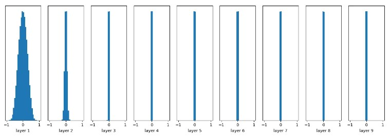
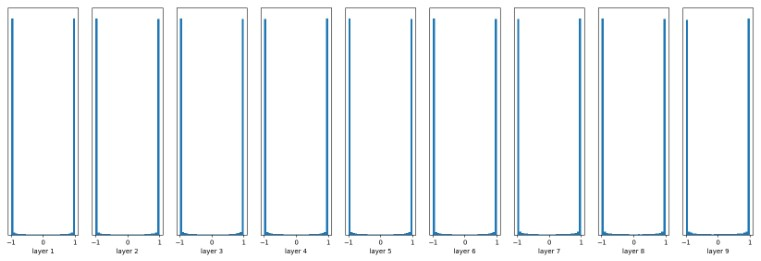

# 1 参数初始化概念(Parameters initialization)
&nbsp;&nbsp;&nbsp;&nbsp;&nbsp;&nbsp;&nbsp;&nbsp;参数初始化(parameters initialization)又称权重初始化(weight initialization), 具体指的是在网络模型训练之前，对各个节点的权重（weight）和偏置（bias）进行初始化赋值的过程。 

&nbsp;&nbsp;&nbsp;&nbsp;&nbsp;&nbsp;&nbsp;&nbsp;深度学习模型训练过程的本质是对 weight（即参数 W）进行更新，但是在最开始训练的时候需要每个参数有相应的初始值，这样神经网络就可以对权重参数w不停地迭代更新，以达到较好的性能。 

# 2 参数初始化的重要性
## 2.1 为什么参数初始化很重要
&nbsp;&nbsp;&nbsp;&nbsp;&nbsp;&nbsp;&nbsp;&nbsp;直观来看，在训练过程中，初始权重直接影响模型的输出，进一步影响损失及回传的梯度。因此，恰当的权重初始化是非常重要的。 

&nbsp;&nbsp;&nbsp;&nbsp;&nbsp;&nbsp;&nbsp;&nbsp;神经网络模型一般依靠随机梯度下降进行模型训练和参数更新，网络的最终性能与收敛得到的最优解直接相关，而收敛结果实际上又很大程度取决于网络参数的最开始的初始化。理想的网络参数初始化使模型训练事半功倍，相反，糟糕的初始化方案不仅会影响网络收敛，甚至会导致梯度弥散或爆炸。 

## 2.1 不合理初始化的问题
&nbsp;&nbsp;&nbsp;&nbsp;&nbsp;&nbsp;&nbsp;&nbsp;如果权值的初始值过大，则会导致梯度爆炸，使得网络不收敛；过小的权值初始值，则会导致梯度消失，会导致网络收敛缓慢或者收敛到局部极小值。 

&nbsp;&nbsp;&nbsp;&nbsp;&nbsp;&nbsp;&nbsp;&nbsp;如果权值的初始值过大，则loss function相对于权值参数的梯度值很大，每次利用梯度下降更新参数的时，参数更新的幅度也会很大，这就导致loss function的值在其最小值附近震荡。 

&nbsp;&nbsp;&nbsp;&nbsp;&nbsp;&nbsp;&nbsp;&nbsp;而过小的初始值则相反，loss关于权值参数的梯度很小，每次更新参数时，更新的幅度也很小，着就会导致loss的收敛很缓慢，或者在收敛到最小值前在某个局部的极小值收敛了。 

# 3 全0或常量初始化
&nbsp;&nbsp;&nbsp;&nbsp;&nbsp;&nbsp;&nbsp;&nbsp;在神经网络中，把Parameters初始化为0是不可以的。这是因为如果把Parameters初始化，那么在前向传播过程中，每一层的神经元学到的东西都是一样的（激活值均为0），而在BP的时候，不同维度的参数会得到相同的更新，因为他们的gradient相同，这种行为称之为 **对称失效**。  

# 4 随机初始化
&nbsp;&nbsp;&nbsp;&nbsp;&nbsp;&nbsp;&nbsp;&nbsp;随机初始化是很多人经常使用的方法，一般初始化的权重为高斯或均匀分布中随机抽取的值。然而这是有弊端的，一旦随机分布选择不当，就会导致网络优化陷入困境。 

## 4.1 较小随机值时
&nbsp;&nbsp;&nbsp;&nbsp;&nbsp;&nbsp;&nbsp;&nbsp; 当我们选择均值为0，标准差为 0.01 的正态分布 $N(0, 0.01)$ 时，随机生成的值都较小，此时经过多个前馈层(MLP) 传播时激活值的分布情况如下图所示： 

&nbsp;&nbsp;&nbsp;&nbsp;&nbsp;&nbsp;&nbsp;&nbsp;可见，当参数初始化很小时，随着层数的增加，我们看到输出值迅速向0靠拢，在后几层中，几乎所有的输出激活值都很接近0。反向传播(BP时)，根据链式法则，激活很小时会使得下层MLP的weight 的梯度很小，产生梯度消失问题.  

## 4.2 较大随机初始值时
&nbsp;&nbsp;&nbsp;&nbsp;&nbsp;&nbsp;&nbsp;&nbsp; 当我们选择均值为0，标准差为 1 的正态分布 $N(0, 0.01)$ 时，随机生成的值集中在距离原点位置为 1 的 ±1 处, 如下图所示。 

&nbsp;&nbsp;&nbsp;&nbsp;&nbsp;&nbsp;&nbsp;&nbsp;我们发现, 几乎所有的值集中在-1或1附近，神经元处于饱和状态(saturated). 注意到tanh/sigmoid 在-1和1附近的gradient都接近0，这同样导致了gradient太小，参数难以被更新 。 

## 4.3 结论 
- 随机初始化其实很难的，尝试太小的值，信息传不过去；
- 值太大的时候梯度信息传递过去了，他们又进入了饱和区，梯度缺变成了0；

# 5 理想的参数初始化
## 5.1 参数初始化的必要条件
&nbsp;&nbsp;&nbsp;&nbsp;&nbsp;&nbsp;&nbsp;&nbsp;综上所述，参数初始化要确保信息能够顺利传递，并且梯度不会出现弥散现象。由此，一般认为参数初始化需满足以下两个必要条件（注意不是充分条件）： 
- 参数初始化必要条件一：各层激活值不会出现饱和现象；
- 参数初始化必要条件二：各层激活值不为0.

## 5.2 Glorot 条件
&nbsp;&nbsp;&nbsp;&nbsp;&nbsp;&nbsp;&nbsp;&nbsp;Glorot条件，也称为Xavier条件，是一种用于初始化神经网络权重的方法。它是由 Xavier Glorot 和 Yoshua Bengio 在2010年提出的。它的核心思想是 **使网络各层的激活值和反向激活梯度的方差在传播过程中尽量保持一致**，以保持网络中正向和反向数据流动。 

*(注释：说的更通俗点就算，随着网络层数的加深，正向激活的分布和反向激活梯度的分布尽量维持一致）*  

**具体的Glorot条件如下：**  
- 各个层的激活值 hidden state 的方差要保持一致, 数学表达为:   
$$\forall(i, i^{\prime}), Var[z^{i}]=Var[z^{i^{\prime}}]$$

- 各个层对状态z的梯度的方差要保持一致, 数学表达式为： 
$$\forall(i, i^{\prime}), Var[\frac{\partial Cost}{\partial s^{i}}]=Var[\frac{\partial Cost}{\partial s^{i'}}]$$

# 6 塞维尔初始化(Xavier initialization)
- [论文链接](https://proceedings.mlr.press/v9/glorot10a/glorot10a.pdf)

# 7 kaiming initialization

- [论文链接](https://arxiv.org/pdf/1502.01852)
# 8 参考文献
- [从基础到凯明](https://towardsdatascience.com/weight-initialization-in-neural-networks-a-journey-from-the-basics-to-kaiming-954fb9b47c79)
- [文献1](https://arxiv.org/pdf/1502.01852.pdf)
- [All you need is a good init](https://arxiv.org/abs/1511.06422)
- [书籍](https://zh-v2.d2l.ai/chapter_multilayer-perceptrons/numerical-stability-and-init.html)
- [文献2](https://cloud.tencent.com/developer/article/1535198)
- [文献3](https://cloud.tencent.com/developer/column/5139)
