# optimizer 概述

&nbsp;&nbsp;&nbsp;&nbsp;&nbsp;&nbsp;&nbsp;&nbsp;深度学习优化器是用于训练神经网络模型的算法或工具。在深度学习中，优化器的目标是通过调整模型的参数，最小化（或最大化）一个损失函数。优化器使用梯度下降等迭代方法来更新模型的参数，以使损失函数达到最优或接近最优。<br>

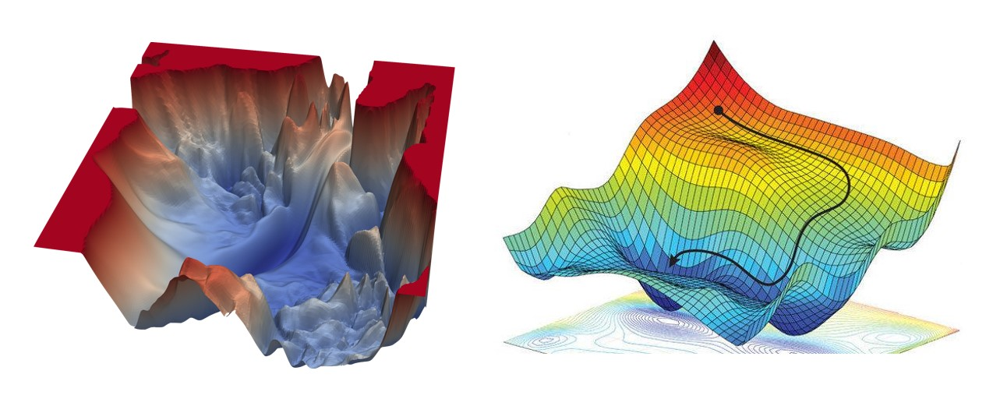

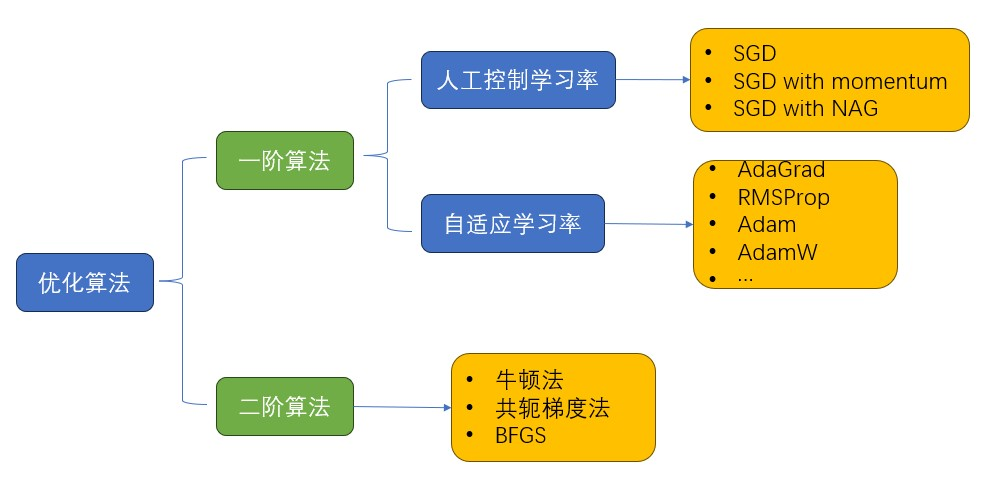

# 1 Gradient Descend
## 1.1 梯度下降法概念
&nbsp;&nbsp;&nbsp;&nbsp;&nbsp;&nbsp;&nbsp;&nbsp;梯度下降法（Gradient Descent）是一种常用的优化算法，用于最小化（或最大化）一个函数。在机器学习和深度学习中，梯度下降法被广泛应用于训练模型，通过调整模型的参数来最小化损失函数。<br>

$$θ = θ - α * \Delta J(θ)$$

其中：<br>
- θ表示要更新的参数向量或矩阵。
- α是学习率（learning rate），控制参数更新的步长。
- ∇J(θ)是损失函数J关于参数θ的梯度向量。

## 1.2 梯度下降法三个变种
### 1.2.1 BGD(Batch Gradient Descend)
&nbsp;&nbsp;&nbsp;&nbsp;&nbsp;&nbsp;&nbsp;&nbsp;BGD是批量梯度下降（Batch Gradient Descent）的缩写，是一种基本的梯度下降优化算法。在批量梯度下降中，每次参数更新时使用整个训练数据集的梯度. <br>

**计算公式** <br>


**图示** <br>
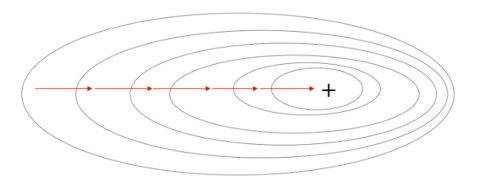

**特点** <br>
- 全局最优解：由于BGD使用整个训练数据集的梯度，它有潜力收敛到全局最优解（如果存在）。
- 低效性：BGD的计算开销较大，因为在每次参数更新步骤中需要计算整个数据集的梯度。对于大规模系统和大型数据集，这可能会导致训练时间较长。
- 稳定性：由于使用整个数据集的梯度，BGD的参数更新相对稳定，不容易受到单个样本或噪声的影响。
- 需要注意的是，尽管BGD可能收敛到全局最优解，但它也可能陷入糟糕的局部最小值中。

### 1.2.2 SGD(Stochastic Gradient Descend)
&nbsp;&nbsp;&nbsp;&nbsp;&nbsp;&nbsp;&nbsp;&nbsp;随机梯度下降（Stochastic Gradient Descent，SGD）是一种基于随机采样的梯度下降优化算法。与批量梯度下降（BGD）每次都使用整个训练数据集的梯度相比，SGD每次仅使用单个样本或一小批样本的梯度进行参数更新。<br>

**计算公式** <br>


**图示** <br>


**特点** <br>
- 更快的更新速度：由于每次更新只使用一个样本或一小批样本的梯度，SGD的参数更新速度比BGD更快。这使得SGD在大规模数据集上具有优势，特别是在迭代次数较少的情况下。
- 可能陷入局部最小值：由于使用随机采样的梯度，SGD的参数更新在每次迭代中都具有一定的随机性。这可能导致SGD在搜索空间中陷入局部最小值，而无法达到全局最优解。
- 然而，这种随机性也有助于SGD跳出局部最小值并继续搜索更好的解。
- 由于其随机性采样和快速更新的特点，SGD能够在多个局部最小值之间进行搜索，有助于找到更好的局部最小值或接近全局最优解。

### 1.2.3 Mini-BGD
&nbsp;&nbsp;&nbsp;&nbsp;&nbsp;&nbsp;&nbsp;&nbsp;Mini-Batch Gradient Descent（小批量梯度下降）是介于批量梯度下降（BGD）和随机梯度下降（SGD）之间的一种梯度下降优化算法。它在每次参数更新时使用一小批次的样本来计算梯度和更新参数. <br>

**计算公式** <br>


**图示** <br>
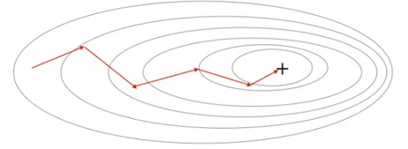

**特点** <br>
- 折中的更新速度：相比于BGD，Mini-Batch Gradient Descent的参数更新速度更快，因为每次使用的样本数量较少。这使得Mini-Batch Gradient Descent在大规模数据集上具有一定的优势。与SGD相比，Mini-Batch Gradient Descent的参数更新速度较慢，但相对更稳定。
- 梯度估计的抖动减少：与SGD相比，Mini-Batch Gradient Descent的梯度估计具有更小的抖动。由于使用的是一小批次的样本，梯度计算的结果更加平滑，减少了随机性带来的波动。
- 内存效率：相对于BGD需要存储整个训练数据集的梯度以及SGD需要存储单个样本的梯度，Mini-Batch Gradient Descent在内存使用方面更有效率。它只需存储每个小批量样本的梯度，使得在处理大型数据集时更加可行。
- 可调节的更新步长：Mini-Batch Gradient Descent的学习率可以根据需要进行调整，以控制参数更新的步长。这使得算法能够更好地平衡快速收敛和避免震荡之间的权衡。

**注意：Mini-BGD Also known as SGD** <br>

# 2 SGD with Momentum
&nbsp;&nbsp;&nbsp;&nbsp;&nbsp;&nbsp;&nbsp;&nbsp;虽然随机梯度下降仍然是非常受欢迎的优化方法，但其学习过程有时会很慢。动量方法 (Polyak, 1964) 旨在加速学习, 特别是处理高曲率、小但一致的梯度, 或是带噪声的梯度。动量算法积累了之前梯度指数级衰减的移动平均, 并且继续沿该方向移动。<br>


## 2.1 算法过程

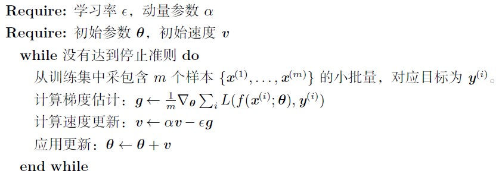

实践中, α 的一般取值为0.5，0.9 和0.99。

## 2.2 算法图示
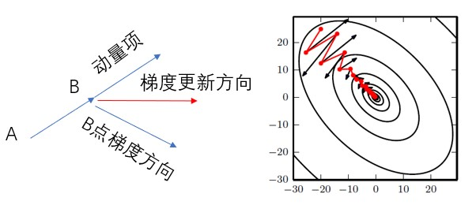

**动态效果展示** <br>
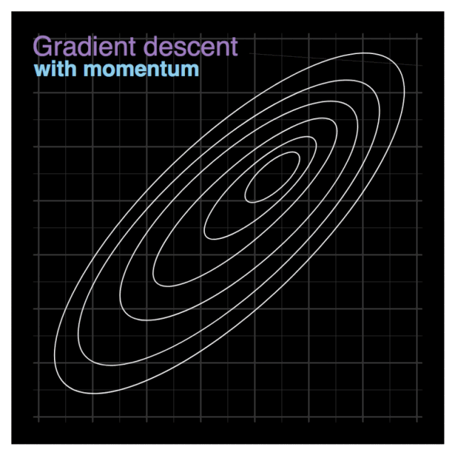

## 2.2 特点
1. 动量的积累：带动量的随机梯度下降利用一个动量变量来积累梯度的历史信息。在每次参数更新时，动量项会考虑前一次更新的方向和幅度。
2. 加速参数更新：由于动量的引入，带动量的随机梯度下降可以加速参数更新的速度。当梯度在相同方向上持续增加时，动量项会逐渐增大，从而加速参数更新。这有助于在梯度方向上形成更大的动量，更快地接近最优解。
3. 减少参数更新方向的震荡：动量项可以减少参数更新方向的震荡，特别是在存在噪声或不稳定梯度的情况下。通过考虑历史梯度的平均方向，动量可以平滑参数更新的路径，减少震荡现象。

## 2.3 作用
- 加速收敛：带动量的随机梯度下降可以加速模型的收敛速度。通过积累历史梯度信息，它能够更快地朝着梯度下降的方向移动，从而加速参数的更新过程。
- 跳出局部最小值：由于动量的引入，带动量的随机梯度下降能够在搜索空间中跳出局部最小值并继续寻找更好的解。通过考虑历史梯度的方向和幅度，动量项可以帮助算法在平坦区域上获得更大的动量，并有助于跳过局部极小点。
- 平滑参数更新路径：动量项可以减少参数更新方向的震荡。通过考虑历史梯度的平均方向，带动量的随机梯度下降可以平滑参数更新的路径，使得参数更新更加稳定。


# 3  NAG（Nesterov Accelerated Gradient）
## 3.1 算法原理
&nbsp;&nbsp;&nbsp;&nbsp;&nbsp;&nbsp;&nbsp;&nbsp;等价于 SGD with Nesterov Momentum，利用当前位置处先前的梯度值先做一个参数更新，然后在更新后的位置再求梯度，将此部分梯度然后跟之前累积下来的梯度值矢量相加，简单的说就是先根据之前累积的梯度方向模拟下一步参数更新后的值，然后将模拟后的位置处梯度替换动量方法中的当前位置梯度。<br>
&nbsp;&nbsp;&nbsp;&nbsp;&nbsp;&nbsp;&nbsp;&nbsp;现在有一个预测后一步位置梯度的步骤，所以当在山谷附近时，预测到会跨过山谷时(跨过山谷后梯度方向会发生变化)，该项梯度就会对之前梯度有个修正，相当于阻止了其跨度太大。<br>

## 3.2 算法原理图
**SGD with Momentum** <br>


**NAG** <br>

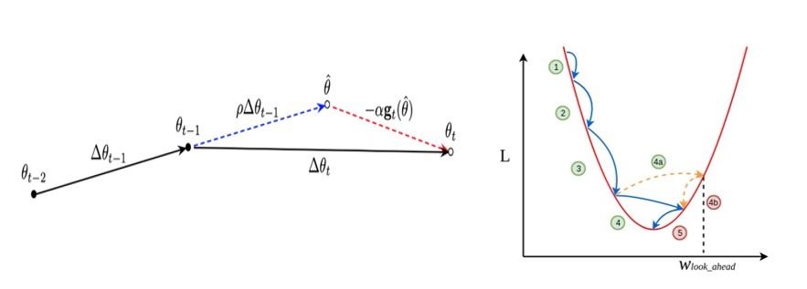


**效果展示** <br>

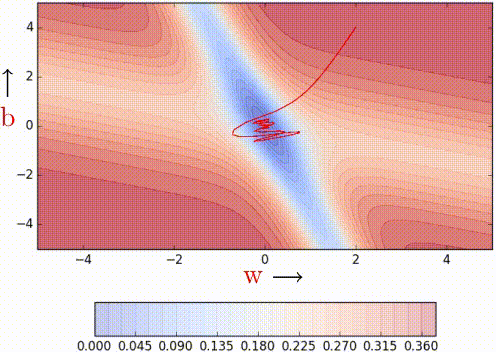

- [参考链接](https://towardsdatascience.com/learning-parameters-part-2-a190bef2d12)

## 3.3 算法详述
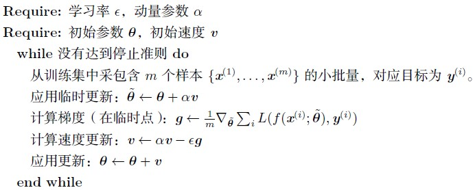

&nbsp;&nbsp;&nbsp;&nbsp;&nbsp;&nbsp;&nbsp;&nbsp;动量的方法，我们发现参数更新是基于两部分组成，一部分为当前位置的梯度，另一部分为前面累计下来的梯度值，参数更新方向就是将两者矢量相加的方向，但是我们会发现一个问题，当刚好下降到山谷附近时，如果这个时候继续以这样的方式更新参数，我们会有一个较大的幅度越过山谷，即：模型遇到山谷不会自动减弱更新的幅度。<br>

- [论文：On the importance of initialization and momentum in deep learning](https://www.cs.toronto.edu/%7Ehinton/absps/momentum.pdf)

# 4 Pytorch 中实现 SGD
- [官网链接](https://pytorch.org/docs/stable/generated/torch.optim.SGD.html#sgd)

## 4.1 算法过程
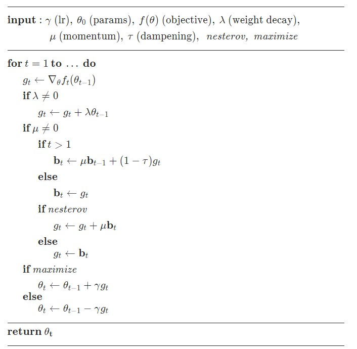

## 4.2 代码实现
```python
import torch
# model = define_model_yourself
optimizer = torch.optim.SGD(model.parameters(), lr=0.1, momentum=0.9)
optimizer.zero_grad()
loss_fn(model(input), target).backward()
optimizer.step()
```

# 5 AdaGrad 优化算法
## 5.1 自适应学习率的概念
&nbsp;&nbsp;&nbsp;&nbsp;&nbsp;&nbsp;&nbsp;&nbsp;神经网络研究员早就意识到学习率肯定是难以设置的超参数之一，因为它对模型的性能有显著的影响。损失通常高度敏感于参数空间中的某些方向，而不敏感于其他。动量算法可以在一定程度缓解这些问题，但这样做的代价是引入了另一个超参数。在这种情况下，自然会问有没有其他方法。如果我们相信方向敏感度在某种程度是轴对齐的，那么每个参数设置不同的学习率，在整个学习过程中自动适应这些学习率是有道理的。<br>

## 5.2 AdaGrad 算法原理
&nbsp;&nbsp;&nbsp;&nbsp;&nbsp;&nbsp;&nbsp;&nbsp;AdaGrad 算法，独立地适应所有模型参数的学习率，缩放每个参数反比于其所有梯度历史平方值总和的平方根(Duchi et al., 2011)。具有损失最大偏导的参数相应地有一个快速下降的学习率，而具有小偏导的参数在学习率上有相对较小的下降。净效果是在参数空间中更为平缓的倾斜方向会取得更大的进步。<br>
&nbsp;&nbsp;&nbsp;&nbsp;&nbsp;&nbsp;&nbsp;&nbsp;在凸优化背景中，AdaGrad 算法具有一些令人满意的理论性质。然而，经验上已经发现，对于训练深度神经网络模型而言，从训练开始时积累梯度平方会导致有效学习率过早和过量的减小。AdaGrad 在某些深度学习模型上效果不错，但不是全部。<br>

## 5.3 AdaGrad 算法
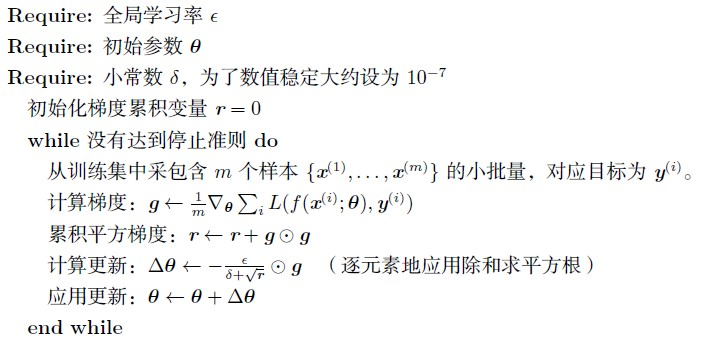

## 5.4 特点
- 前期较小的时候， 分母较小，能够放大梯度;
- 后期较大的时候， 分母较大，能够约束梯度;
- 无需手动调整梯度，为了避免分母为0，加了一项随机扰动.

## 5.5 缺点
- 仍依赖于人工设置一个全局学习率，一般采用默认值0.01；
- 起始梯度 η 设置过大的话，会使分母过于敏感，对梯度的调节太大；
- 中后期，分母上梯度平方的累加将会越来越大，分母会不断积累使 Δθt -> 0，学习率就会收缩并最终会变得非常小使得训练提前结束.

## 5.6 pytorch 实现
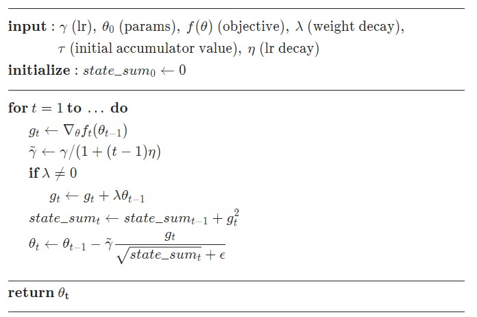

- 要点：带了lr decay 和 weight decay

- [论文：Adaptive Subgradient Methods for Online Learning and Stochastic Optimization](https://jmlr.org/papers/volume12/duchi11a/duchi11a.pdf)


# 6 RMSProp 优化算法
RMSProp（Root Mean Square Propagation）算法中，RMS指的是均方根（Root Mean Square）。RMSProp 已被证明是一种有效且实用的深度神经网络优化算法。目前
它是深度学习从业者经常采用的优化方法之一， 对RNN 效果很好。<br>

## 6.1 理论基础
&nbsp;&nbsp;&nbsp;&nbsp;&nbsp;&nbsp;&nbsp;&nbsp;RMSProp 算法(Hinton, 2012) 修改AdaGrad 以在非凸设定下效果更好，改变梯度积累为指数加权的移动平均。AdaGrad 旨在应用于凸问题时快速收敛。当应用于非凸函数训练神经网络时，学习轨迹可能穿过了很多不同的结构，最终到达一个局部是凸碗的区域。AdaGrad 根据平方梯度的整个历史收缩学习率，可能使得学习率在达到这样的凸结构前就变得太小了。RMSProp 使用指数衰减平均以丢弃遥远过去的历史，使其能够在找到凸碗状结构后快速收敛，它就像一个初始化于该碗状结构的AdaGrad 算法实例。<br>

&nbsp;&nbsp;&nbsp;&nbsp;&nbsp;&nbsp;&nbsp;&nbsp;相比于AdaGrad，使用移动平均引入了一个新的超参数ρ，用来控制移动平均的长度范围。<br>
## 6.2 算法流程
**RMSProp 的标准形式** <br>
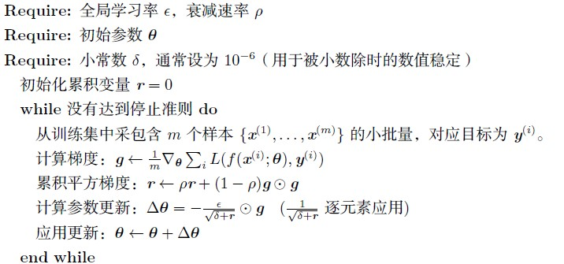

**带Nesterov 动量的形式** <br>
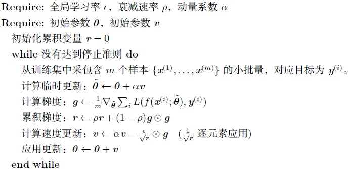

- Hinton 建议设定 γ 为 0.9, 学习率 η 为 0.001。

## 6.3 pytorch 实现


- [pytorch link](https://pytorch.org/docs/stable/generated/torch.optim.RMSprop.html#torch.optim.RMSprop)
- [ppt link](https://www.cs.toronto.edu/~tijmen/csc321/slides/lecture_slides_lec6.pdf)

# 7 Adadelta
## 7.1 概述
&nbsp;&nbsp;&nbsp;&nbsp;&nbsp;&nbsp;&nbsp;&nbsp;Adadelta 是对 Adagrad 和 RMSProp 的扩展，AgaGrad会累加所有历史梯度的平方，而Adadelta只累加固定大小的项，并且也不直接存储这些项，仅仅是近似计算对应的平均值。另外，学习率也可以设置为 $RMS[\Delta \theta]$ . <br>

## 7.2 算法流程


## 7.3 pytorch 实现
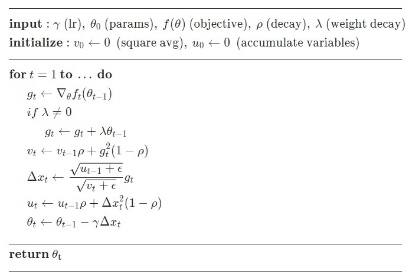

- [pytorch link](https://pytorch.org/docs/stable/generated/torch.optim.Adadelta.html#torch.optim.Adadelta)
- [论文：ADADELTA: An Adaptive Learning Rate Method](https://arxiv.org/pdf/1212.5701.pdf)

# 8  不同优化算法效果对比
## 8.1 loss 对比图
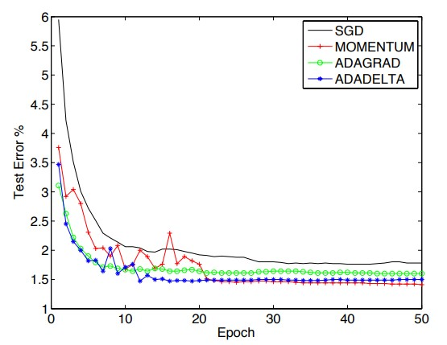

## 8.2 收敛过程对比


&nbsp;&nbsp;&nbsp;&nbsp;&nbsp;&nbsp;&nbsp;&nbsp;Adagrad, Adadelta, RMSprop 几乎很快就找到了正确的方向并前进，收敛速度也相当快，而其它方法要么很慢，要么走了很多弯路才找到。

**思考：哪种优化算法最好呢？？？** <br>

# 9 Adam 优化器
# 9.1 原理概述
&nbsp;&nbsp;&nbsp;&nbsp;&nbsp;&nbsp;&nbsp;&nbsp;Adam (Kingma and Ba, 2014) 是另一种学习率自适应的优化算法。**Adam** 这个名字派生自短语 **adaptive moments** 。早期算法背景下，它也许最好被看作结合RMSProp 和具有一些重要区别的动量的变种。首先，在Adam 中，动量直接并入了梯度一阶矩（指数加权）的估计。将动量加入RMSProp 最直观的方法是将动量应用于缩放后的梯度。结合缩放的动量使用没有明确的理论动机。其次，Adam 包括偏置修正，修正从原点初始化的一阶矩（动量项）和（非中心的）二阶矩的估计（算法8.7 ）。RMSProp 也采用了（非中心的）二阶矩估计，然而缺失了修正因子。因此，不像Adam，RMSProp 二阶矩估计可能在训练初期有很高的偏置。Adam 通常被认为对超参数的选择相当鲁棒，尽管学习率有时需要从建议的默认修改。<br>

- [论文：ADAM: A METHOD FOR STOCHASTIC(随机) OPTIMIZATION](https://arxiv.org/pdf/1412.6980.pdf)

## 9.2 算法实现流程


## 9.3 pytorch 实现
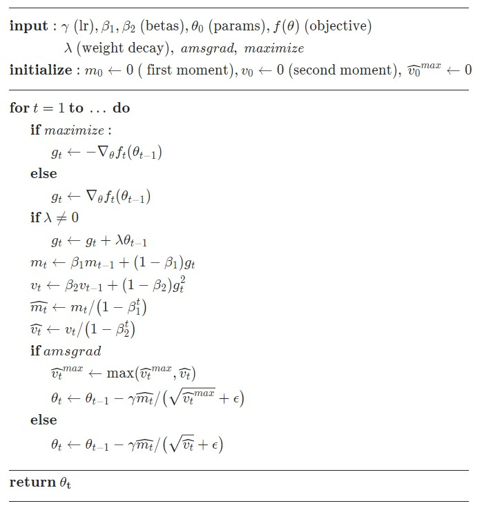

- [pytorch link](https://pytorch.org/docs/stable/generated/torch.optim.Adam.html#torch.optim.Adam)

## 9.4 效果展示
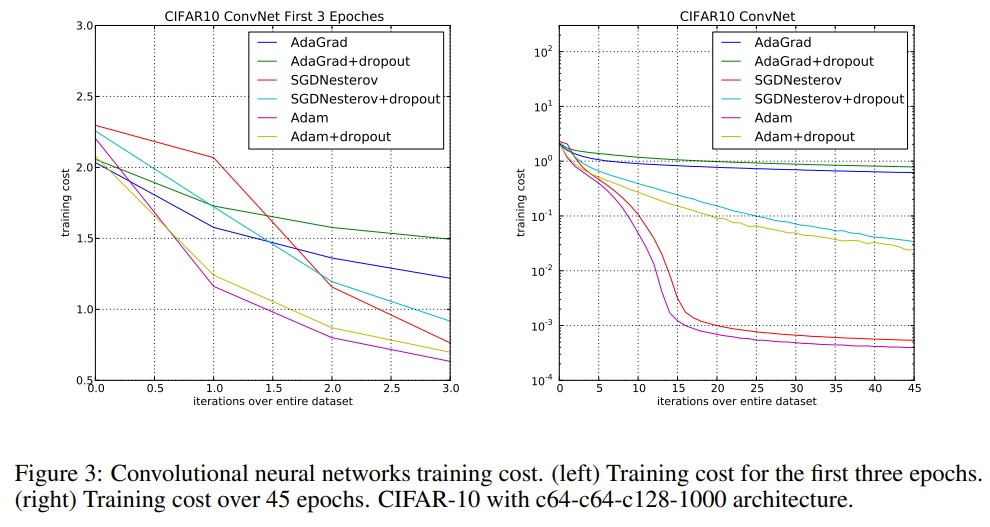

# 10 AdamW
## 10.1 算法原理
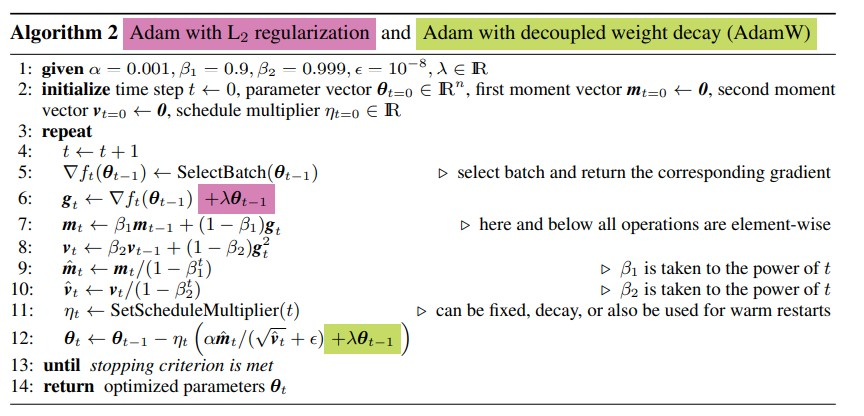

- [论文：DECOUPLED(解耦) WEIGHT DECAY REGULARIZATION](https://arxiv.org/pdf/1711.05101.pdf)

## 10.2 pytorch实现
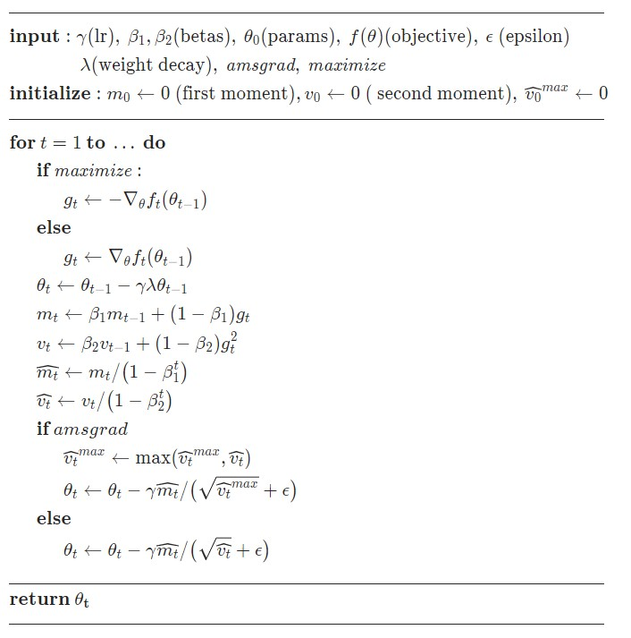

- [pytorch link](https://pytorch.org/docs/stable/generated/torch.optim.AdamW.html#torch.optim.AdamW)

# 11 Optimizer 收敛趋势对比图

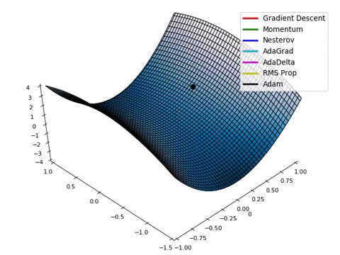

# 12 参考文献
- [Optimization Algorithms](https://prvnk10.medium.com/optimization-algorithms-part-1-4b8aba0e40c6)
- [github optimize demo](https://github.com/prajinkhadka/Optimization_Algorithms_Visualization)
- [论文：An overview of gradient descent optimization algorithms](https://arxiv.org/pdf/1609.04747.pdf)
- [Machine Learning Optimization Methods : Mechanics, Pros, And Cons](https://salmenzouari.medium.com/machine-learning-optimization-methods-mechanics-pros-and-cons-81b720194292)


