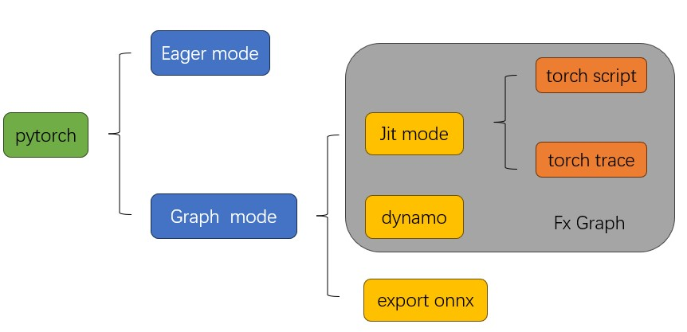

# 1 pytorch 几种模式概览

## 1.1 pytorch 不仅仅是动态图



## 1.2 理解动态图和静态图
&nbsp;&nbsp;&nbsp;&nbsp;&nbsp;&nbsp;&nbsp;&nbsp;&nbsp;静态图（Static Graph）和动态图（Dynamic Graph）是两种不同的计算图表示形式，用于描述深度学习模型的计算过程。<br>

&nbsp;&nbsp;&nbsp;&nbsp;&nbsp;&nbsp;&nbsp;&nbsp;&nbsp;静态图是在模型定义阶段构建的计算图，其中所有的操作和数据流都在定义时确定。它以一种静态的方式表示模型的结构和计算逻辑，并且在执行过程中不会改变。静态图的一个典型示例是TensorFlow的计算图。在静态图中，模型的计算图在执行前需要显式地进行编译和优化，然后可以重复地执行编译后的图形，以获得更高的执行效率。<br>

&nbsp;&nbsp;&nbsp;&nbsp;&nbsp;&nbsp;&nbsp;&nbsp;&nbsp;动态图是在模型执行阶段构建的计算图，其中计算图是根据实际输入数据的流动而动态生成的。它以一种动态的方式表示模型的计算过程，并且可以根据不同的输入数据进行灵活的控制流操作。动态图的一个典型示例是PyTorch的计算图。在动态图中，模型的计算图是根据实际输入数据动态构建的，这样可以更灵活地处理变长序列数据、条件分支和循环等情况。<br>

&nbsp;&nbsp;&nbsp;&nbsp;&nbsp;&nbsp;&nbsp;&nbsp;&nbsp;静态图和动态图各有其优势和应用场景。静态图在模型执行前可以进行静态优化和编译，从而在执行过程中获得更高的性能。它适用于具有固定结构和无需动态控制流的模型。动态图更灵活，能够处理动态控制流和变长输入数据等情况，适用于具有动态特性和复杂逻辑的模型。由于动态图可以根据实际输入数据生成计算图，因此它在模型的调试和开发过程中更具交互性和可读性。<br>

## 1.3 静态图的优势
- 图优化：
&nbsp;&nbsp;&nbsp;&nbsp;&nbsp;&nbsp;&nbsp;&nbsp;&nbsp;静态图允许PyTorch在转换过程中应用一系列的图优化技术。这些优化包括常量折叠、死代码消除、运算融合、内存优化等，可以减少不必要的计算、内存消耗和数据传输，从而提高模型的执行效率。<br>

- 编译优化：
&nbsp;&nbsp;&nbsp;&nbsp;&nbsp;&nbsp;&nbsp;&nbsp;&nbsp;静态图需要在转换过程中进行编译，将动态操作转换为优化的静态内核。这种编译过程可以包括静态类型推断、代码生成和优化等步骤，可以提前优化模型的计算图，并生成高效的机器代码。<br>

# 2 几种模式简介
## 2.1 fx 图
&nbsp;&nbsp;&nbsp;&nbsp;&nbsp;&nbsp;&nbsp;&nbsp;&nbsp;在PyTorch中，FX图（FX Graph）是一种中间表示形式，用于表示和转换PyTorch模型。FX图是一种基于符号执行的图表示，类似于抽象语法树（AST），用于表示模型的计算图及其相关操作。FX图本身并不能直接运行。FX图是一种中间表示形式，用于表示和转换PyTorch模型，而非用于实际的模型执行。<br>

## 2.2 torch.jit.script
&nbsp;&nbsp;&nbsp;&nbsp;&nbsp;&nbsp;&nbsp;&nbsp;&nbsp;jit.script通过静态分析和推断来捕获模型的计算图。具体来说，当使用jit.script装饰器标记模型的函数时，PyTorch会执行以下步骤来进行捕获：<br>

- 静态分析：<br>
&nbsp;&nbsp;&nbsp;&nbsp;&nbsp;&nbsp;&nbsp;&nbsp;&nbsp;PyTorch会对模型函数进行静态分析，分析模型的结构、操作和控制流等信息。它会检查函数中的各种操作符和模块，并构建一个计算图的表示形式。<br>

- 类型推断：<br>
&nbsp;&nbsp;&nbsp;&nbsp;&nbsp;&nbsp;&nbsp;&nbsp;&nbsp;PyTorch会进行类型推断，根据输入和操作的语义来确定操作的数据类型。这有助于生成正确的计算图，并在后续的转换过程中进行类型检查。<br>

- 生成脚本：<br>
&nbsp;&nbsp;&nbsp;&nbsp;&nbsp;&nbsp;&nbsp;&nbsp;&nbsp;根据分析和推断的结果，PyTorch会生成一个独立的可运行脚本，其中包含模型的结构和计算逻辑。这个脚本是模型的静态表示形式，不再依赖于动态图和Python解释器。<br>

## 2.3 torch.jit.trace
&nbsp;&nbsp;&nbsp;&nbsp;&nbsp;&nbsp;&nbsp;&nbsp;&nbsp;jit.trace：jit.trace是将PyTorch模型转换为跟踪形式的工具。它通过跟踪模型的输入和输出，捕获模型的执行轨迹，并将其转换为一个可重放的跟踪模型。这个跟踪模型可以在后续的推理过程中重复使用，避免了重复的图构建和优化过程。使用jit.trace时，通常需要提供示例输入来触发模型的执行并捕获跟踪。<br>

## 2.4 torch.copile
&nbsp;&nbsp;&nbsp;&nbsp;&nbsp;&nbsp;&nbsp;&nbsp;&nbsp;torch.compile是最新的方法，可以加速您的PyTorch代码！torch.compile通过即时编译(PyTorch代码编译成优化内核)来使PyTorch代码运行更快，同时需要最小的代码更改。<br>

# 3 案例：
## 3.1 模型准备
```python
# 定义数据集
class MyDataset(data.Dataset):
    def __init__(self):
        # fake data
        self.data = torch.randn(100, 10)
        self.target = torch.randint(0, 2, (100,))
        
    def __getitem__(self, index):
        return self.data[index], self.target[index]
    
    def __len__(self):
        return len(self.data)

# 定义模型
class MyModel(nn.Module):
    def __init__(self):
        super(MyModel, self).__init__()
        self.fc1 = nn.Linear(10, 5)
        self.fc2 = nn.Linear(5, 2)
        
    def forward(self, x):
        x = self.fc1(x)
        x = nn.functional.relu(x)
        x = self.fc2(x)
        return x

# 定义训练函数
def train(model, dataset, optimizer, criterion, epochs):
    for epoch in range(epochs):
        running_loss = 0.0
        correct = 0
        total = 0
        
        for data, target in dataset:
            # 将数据和目标转换为Tensor类型
            data = torch.tensor(data)
            target = torch.tensor(target)

            # 前向传播
            output = model(data)
            loss = criterion(output, target)

            # 反向传播和优化
            optimizer.zero_grad()
            loss.backward()
            optimizer.step()

            # 统计损失和正确率
            running_loss += loss.item()
            _, predicted = torch.max(output.data, 1)
            total += target.size(0)
            correct += (predicted == target).sum().item()

        # 打印训练信息
        print('Epoch [{}/{}], Loss: {:.4f}, Accuracy: {:.2f}%'
              .format(epoch+1, epochs, running_loss/len(dataset), 100*correct/total))
```

## 3.2 jit.script 代码展示
```python
def script_demo():
    # 实例化模型
    model = MyModel()
    # 将模型转换为script模式
    scripted_model = torch.jit.script(model)
    # 定义优化器和损失函数
    optimizer = optim.SGD(scripted_model.parameters(), lr=0.01)
    criterion = nn.CrossEntropyLoss()    
    # 实例化数据集和数据加载器
    dataset = MyDataset()
    dataloader = data.DataLoader(dataset, batch_size=10, shuffle=True)

    # 调用训练函数
    train(scripted_model, dataloader, optimizer, criterion, epochs=10)
    scripted_model.save("scripted_model.pt")

def run_script_model():
    model = torch.jit.load("scripted_model.pt")
    output = model(torch.rand(4, 10))
    print("output: ", output)
```

## 3.3 jit.traced 代码展示
```python
def traced_demo():
    model = MyModel()
    scripted_model = torch.jit.trace(model, torch.randn(1, 10))

    # 保存模型到文件
    scripted_model.save("traced_model.pt")

    # 重新加载模型
    loaded_model = torch.jit.load("traced_model.pt")

    # 重新运行模型
    input_data = torch.randn(1, 10)
    output_data = loaded_model(input_data)
    print("traced model output: ", output_data)
```

# 4 export to onnx
```python
def onnx_demo():
    model = MyModel()
    torch.onnx.export(model, torch.randn(4, 10), "onnx_model.onnx")
       
def onnx_infer():
    input = torch.randn(4,10)
    # 加载模型并运行
    import onnxruntime as ort
    ort_session = ort.InferenceSession("onnx_model.onnx") # 加载模型到 session中
    ort_inputs = {ort_session.get_inputs()[0].name: input.numpy()} # 设置我们input --> numpy 格式的数据
    ort_outputs = ort_session.run(None, ort_inputs) # 开始run --> outputs --
    print("onnx run output: ", ort_outputs[0]) # 取出结果
```

# 5 compile to graph (dynamo)
```python
# Reset since we are using a different mode.
import torch._dynamo
torch._dynamo.reset()

# 方式一：      
def train(model, dataloader):
    model = torch.compile(model) # 是有开销的
    for batch in dataloader:
        run_epoch(model, batch)

    def infer(model, input):
        model = torch.compile(model)
        return model(input)
    
# 方式二：
@torch.compile
def opt_foo2(x, y):
    a = torch.sin(x)
    b = torch.cos(y)
    return a + b
print(opt_foo2(torch.randn(10, 10), torch.randn(10, 10)))
```
