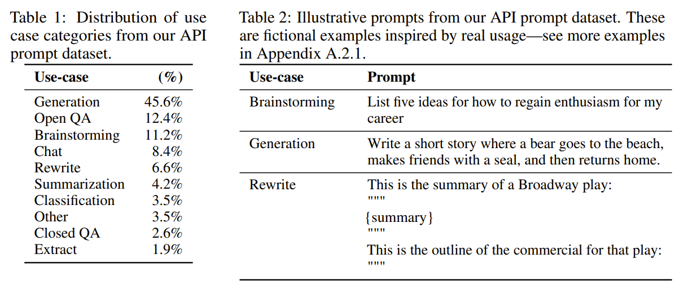
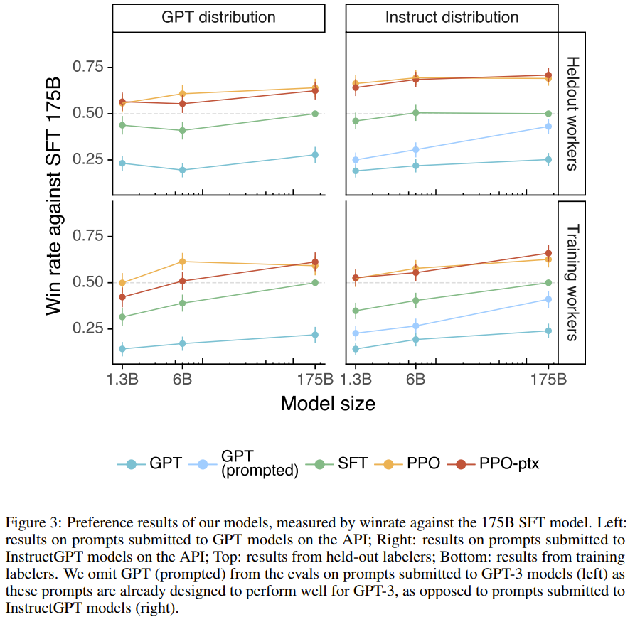

# 1. InstructGPT论文精读：大模型调教之道

- [论文链接](https://arxiv.org/pdf/2203.02155.pdf)
- [参考连接](https://juejin.cn/post/7288624193956216869)

**ChatGPT采用了与InstructGPT相同的方法，只是在数据集在些许差异。** 如下所示是ChatGPT在OpenAI官网上的介绍：

>   * **ChatGPT is a sibling model to InstructGPT** , which is trained to
> follow an instruction in a prompt and provide a detailed response.
>   * We trained this model using Reinforcement Learning from Human Feedback
> (RLHF), **using the same methods as InstructGPT** , but with slight
> differences in the data collection setup.
>

因此，今天我们将跟随论文一起深入了解InstructGPT的细节，以便对ChatGPT背后的技术有一个更加清晰的认知。

>   * 论文： Training language models to follow instructions with human feedback
>
>   * 模型参数： 1750亿
>
>   * 公司/机构： OpenAI
>
>

# 摘要

**语言模型的规模增大并不能保证其更好地遵循用户的意图。** 较大规模的语言模型可能会产生不真实、有害或对用户毫无用处的输出，与用户意图背道而驰。

为了解决这一问题，研究人员通过使用人类反馈，使语言模型在各种任务中能够与用户意图保持一致。首先，**通过收集标注员编写或OpenAI
API提交的prompts来微调GPT-3以满足所需行为** 。接着，**利用人类对模型输出进行排序的数据集，采用强化学习进行进一步微调**
，最终形成了`InstructGPT`模型。

人类评估结果显示，**相较于具有1750亿参数的GPT-3模型，InstructGPT模型在参数量减少100倍的情况下，其输出也更受欢迎。**
此外，InstructGPT在生成真实性方面有所提高，并减少了生成有害输出的情况。

# 研究动机

语言模型往往会出现意想不到的行为，如虚构事实、生成带有偏见或有害文本、不遵循用户指令等。这是因为**模型的语言建模目标与安全遵循用户指令的目标不一致。**

因此，研究者们努力通过训练来保证语言模型满足用户期望，包括**有帮助、诚实、无害**
等要求。这有助于避免部署和使用这些模型时出现意外行为，从而保证其安全性和可靠性。

InstructGPT正是在这一背景下的产物。

# InstructGPT模型调教流程

InstructGPT的调教过程主要有以下三个步骤：

**Step1：有监督微调（SFT）。** 在人工标注的prompts数据集上对预训练好的GPT-3进行微调。

**Step2：训练奖励模型（RM）。**
收集了一系列语言模型输出结果的排序数据集。具体而言，对于给定的提示（prompt），语言模型生成了多个输出，然后由标注员对这些输出进行排序。接下来，我们使用这些排序数据集进行训练，构建了一个奖励模型，可以预测人类对输出结果的偏好排序。

**Step3：使用强化学习优化奖励模型。** 具体而言，使用PPO算法（Proximal Policy
Optimization）对奖励模型进行训练，其输出是一个标量值。

Step2和Step3可以连续迭代进行。可以利用当前最佳策略，不断收集更多排序数据，用于训练新的奖励模型。**在InstructGPT中，大部分的排序数据集来自人工标注，同时有一部分来自PPO策略。**

## 数据集

InstructGPT的三个训练步骤分别对应**SFT数据集、RM数据集和PPO数据集，** 数据集超过96％都是英文。

三个数据集的大小如Table 6所示：

InstructGPT的训练数据主要来自以下两个途径：

**1\. 来自OpenAI API的Prompts。**
根据用户ID生成了训练、验证和测试数据集。为确保数据的质量，对数据进行了去重处理，并限制每个用户ID提交的Prompts数量不超过200
条。同时，在筛选训练数据时，严格排除了可能包含个人可识别信息（PII）的Prompts，以确保客户信息的安全性。

**2\. 标注员编写的Prompts数据集。**
标注员编写的数据集主要包含三种类型，分别为通用Prompts、少样本Prompts和基于用户需求的Prompts。通用Prompts要求多样性的任务，少样本Prompts则提供指令及对应查询响应。针对提交给OpenAI
API等候列表的使用案例，我们要求标注员提供与之相应的Prompts。

Table 1中展示了RM数据集的类别分布，可以看到，**这些prompts非常多样化，包括生成、问答、对话、摘要、提取和其他自然语言任务。** Table
2中展示了一些示例prompts。

## 模型结构及训练过程

**InstructGPT使用GPT-3作为预训练模型，** 并使用以下三种技术进行微调：

`GPT-3精读可在我们的历史文章中找到！`

### 有监督微调（Supervised fine-tuning，SFT）

采用标注员人工标注的数据进行训练，训练`epoch`设置为16，并根据验证集上的RM分数选择最佳的SFT模型。

### 奖励建模（Reward modeling，RM）

把上一个步骤得到的SFT模型的最后一层unembedding layer移除，训练一个模型，这个模型接收一个问题`prompt`和回答`response`，然后输出一个标量`reward`。

**RM的大小仅为6B，** 一方面是这样可以有效节省计算资源，另一方面是作者发现175B的RM在强化学习中作为值函数训练不太稳定。

具体来说，**奖励模型的损失函数** 如下：

其中，$r_{θ}(x,y)$ 奖励模型对于prompt x和回答y的输出标量值，θ是参数。D是比较数据集。$y_w$ 是比 $y_l$ 排序位置更高的response，所以希望 $r_θ(x,y_w)$ 与 $r_θ(x,y_l)$ 的差值尽可能大。

### 强化学习（Reinforcement learning，RL）

**使用`PPO算法`对第一阶段训练的SFT模型进行微调。** 该模型接收一个问题prompt x，并生成一个回应y，将x和y输入到之前训练的奖励模型中，得到一个奖励分数，然后使用梯度下降法来更新模型策略。

此外，为了减轻奖励模型的过拟合问题，作者还在每个token上添加了来自**SFT模型的KL散度惩罚项** 。

为了解决在公共NLP数据集上性能退化的问题，作者**将预训练梯度与PPO梯度进行混合** ，形成了一种名为`PPO-ptx`的模型。

在强化学习训练中，作者致力于最大化以下目标函数：

其中，$π^{RL}_{Φ}$ 是学习到的强化学习策略。$π^{SFT}$ 是第一阶段有监督训练的SFT模型。$D_{pretrain}$是预训练分布。KL奖励系数β和预训练损失系数γ分别控制了KL惩罚和`预训练梯度`的强度。

**第二项目标函数中包含一个KL散度惩罚项** ，这是因为在训练奖励模型时，y数据来自于SFT模型。然而在进行推理任务时，y数据来自于新的强化学习策略模型。

训练过程中，随着模型策略的更新，新模型生成的y可能会偏离该奖励模型训练时输入的y，从而导致奖励模型的估计不太准确。

为了解决这个问题，引入了KL散度惩罚项。**KL散度惩罚项的作用是希望强化学习新模型输出的y的概率分布不与SFT模型输出的y的概率分布有太大差异。**

**第三项目标函数的目的是避免仅在新数据集上表现良好，而在原始GPT3预训练数据集上表现下降。**
为此，在使用新数据训练的同时，也采样了部分原始GPT3的训练数据，其中γ参数控制了倾向于使用原始数据集的程度。

## 实验结果

Figure 3展示了各种模型在OpenAI
API提交的数据集上的人类评估结果。评估标准是衡量每个模型输出相对于拥有1750亿参数的SFT模型更受欢迎的频率。

InstructGPT模型（`PPO-
ptx`）以及其未进行预训练梯度混合的变体（`PPO`）在这个评估中表现出明显的优势，超越了GPT-3的基准模型（`GPT`、`GPT
prompted`）。从图中可以发现，**经过新的数据集微调和强化学习训练后，即使是1.3B的模型表现也好于GPT-3和只经过微调的GPT-3。**

当使用不同来源的数据集进行测试时，Instruct GPT都表现了相同的优势。具体见Figure 4。

**InstructGPT模型在未经过RLHF微调的指令上展现了出色的泛化能力，尤其是在处理非英语语言和代码相关指令时。**
值得一提的是，即使这些非英语语言和代码只占据了我们微调数据的一小部分。

在与175B PPO-ptx模型进行交互时，作者发现InstructGPT仍然会犯一些简单的错误。以下是InstructGPT犯下的一些错误行为：

**行为1：** 对于带有错误前提的指令，模型有时会错误地假设前提是真实的。

**行为2：** 模型有时过于谨慎，在面对一个简单问题时，它可能会表达出这个问题没有一个确切的答案，即使上下文已经明确表明答案。

**行为3：**
当指令中包含多个明确的约束条件（如：请列出20世纪30年代在法国拍摄的10部电影）或对语言模型来说有挑战性的限制时（如：用指定数量的句子写一篇摘要），模型的性能将下降。

Figure 9呈现了这些行为的一些示例。

对于行为1，作者认为其发生的原因是**训练集中很少包含错误前提的prompts** ，导致模型在这些情况下的泛化能力较弱。

对于行为2，作者怀疑其出现的部分原因是在标注者标注排序数据集时要求他们考虑到回答表达是否谦逊，因此，**他们可能更倾向于那些含糊其辞的输出，而这一偏好正是被奖励模型所学到**
。

当然，通过对抗性数据收集，这两种行为都有望得到显著减少。

# 写在最后

ChatGPT是InstructGPT的姊妹模型，**两者在技术路线的使用上完全一致**。本文详细总结了InstructGPT的技术原理，深度解析了OpenAI对大模型的调教之道。

# 2 GPT3.5

| 英文 | 中文 | 释义 |
| :--: | :--: | :--: |
| Emergent Ability | 突现能力 | 小模型没有，只在模型大到一定程度才会出现的能力 |
| Prompt | 提示词 | 把 prompt 输入给大模型，大模型给出 completion |
| In-Context Learning | 上下文学习 | 在 prompt 里面写几个例子，模型就可以照着这些例子做生成 |
| Instruction Tuning | 指令微调 | 用 instruction 来 fine-tune 大模型 |
| Code Tuning | 在代码上微调 | 用代码来 fine-tune 大模型 |
| Reinforcement Learning with Human Feedback (RLHF) | 基于人类反馈的强化学习 | 让人给模型生成的结果打分，用人打的分来调整模型 |
| Chain-of-Thought | 思维链 | 在写 prompt 的时候，不仅给出结果，还要一步一步地写结果是怎么推出来的 |
| Scaling Laws | 缩放法则 | 模型的效果的线性增长要求模型的大小指数增长 |
| Alignment | 与人类对齐 | 让机器生成复合人类期望的，复合人类价值观的句子 |

# 3 GPT4

