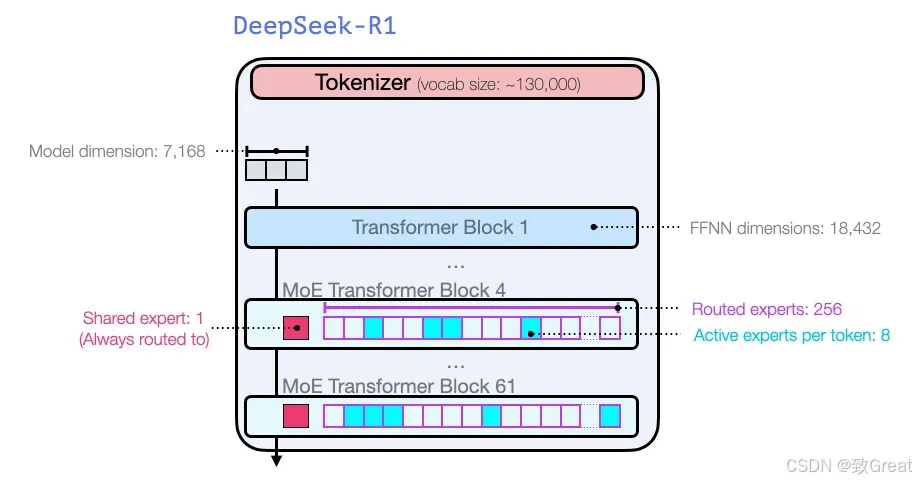
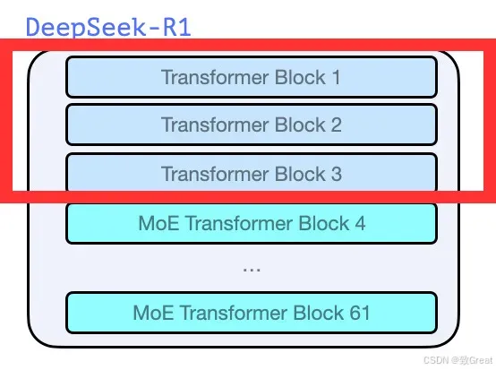
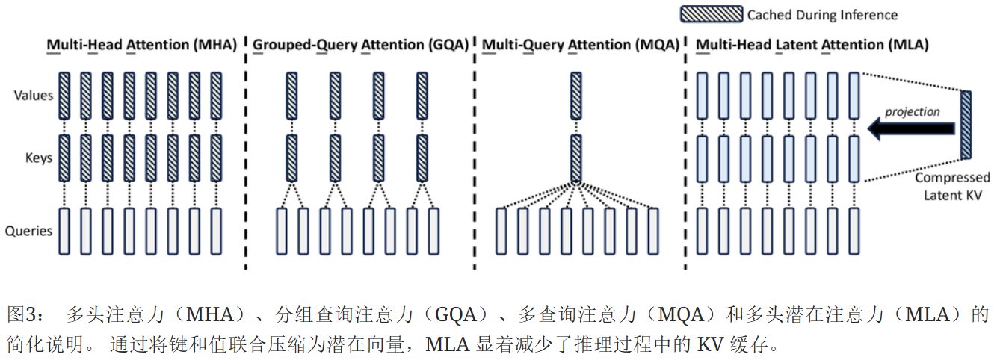
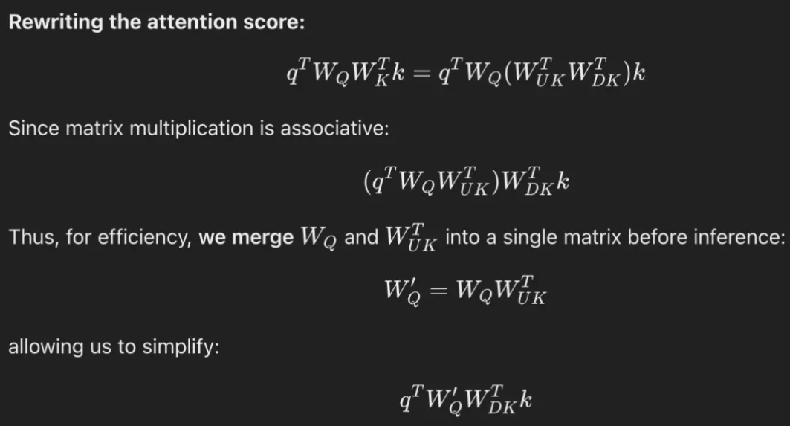

# 0 相关论文全汇总

**DeepSeek-V2**  

- [论文链接-EN](https://arxiv.org/pdf/2405.04434)
- [论文链接-CN](https://yiyibooks.cn/arxiv/2405.04434v5/index.html)

**DeepSeek-MOE**  

- [论文链接-EN](https://arxiv.org/pdf/2401.06066)
- [论文链接-CN](https://yiyibooks.cn/arxiv/2401.06066v1/index.html)

**DeepSeek-V3**  

- [论文链接-EN](https://arxiv.org/pdf/2412.19437)
- [论文链接-CN](https://yiyibooks.cn/arxiv/2412.19437v1/index.html)

**DeepSeek-R1**  

- [论文链接-EN](https://arxiv.org/pdf/2501.12948)
- [论文链接-CN](https://yiyibooks.cn/arxiv/2501.12948v1/index.html)

# 1. DeepSeek-R1 模型架构全解

本文深入探讨了 DeepSeek-R1 模型架构。让我们从输入到输出追踪 DeepSeek-R1 模型，以找到架构中的新发展和关键部分。DeepSeek-R1 基于 DeepSeek-V3-Base 模型架构。本文旨在涵盖其设计的所有重要方面。 

## 1. 输入上下文长度

**DeepSeek-R1 的输入上下文长度为 128K。**

DeepSeek-R1 从其基础模型 DeepSeek-V3-Base 继承了 128K 上下文长度。最初，DeepSeek-V3 使用 4K 上下文长度进行预训练。然后，利用 **YaRN 技术**，通过两阶段上下文长度扩展，首先将其增加到 32K，然后扩展到 128K。

### 什么是 YaRN？

**YaRN（另一种 RoPE 扩展方法）** 是一种旨在有效扩展使用旋转位置嵌入 (RoPE) 的大型语言模型 (LLM) 上下文窗口的技术。以下是其特点：

- **RoPE** 使用旋转矩阵对位置信息进行编码。
- **YaRN** 修改这些旋转频率的缩放方式，而不是简单地推断频率。
- **优点**：
  - 更好地推广到更长的上下文。
  - 计算上高效。
  - 无需大量重新训练即可扩展模型上下文长度。

---

## 2. 总层数

**DeepSeek-R1** 包含以下结构：

DeepSeek-R1 由一个嵌入层、其后的 61 个变换器层以及输出阶段的多个预测头组成。

DeepSeek-R1 在所有 Transformer 层上采用多头潜在注意力 (MLA) 层，而不是标准多头注意力。前三个 Transformer 层与其他层不同，使用标准前馈网络 (FFN) 层。从第 4 层到第 61 层，混合专家 (MoE) 层取代了 FFN 层。MLA 和 MoE 的细节将在以下部分中探讨。 

带有维度的完整模型架构描述：

DeepSeek-V3使用多标记预测 (MTP) 技术，利用最后两个预测头预测接下来的2 个标记。第二个预测标记的接受率介于85% 和 90%之间，表明在各个生成主题中均具有很高的可靠性。 DeepSeek-R1 (DeepSeek-V3) 总共包含 671B 个参数，其中每个标记激活 37B 个。在这里插入图片描述.

---

## 3. 前 3 个 DeepSeek-R1 层

前 3 层由多头潜在注意力 (MLA) 和标准 FFN 层组成。这些通常被称为“密集 LLM 层”，因为 FFN 层不会被 MoE 层取代，相比之下 MoE 层被认为更稀疏。

---

## 4. DeepSeek-R1 的第 4 层至第 61 层

这些层由 MLA 层和 MoE 层组成。我们将在接下来的部分中了解什么是 MLA 层和 MoE 层以及它们如何工作。

> MoE Transformer 层

---

## 5. 多头潜在注意力 (MLA)

### 什么是 MLA？

现在让我们了解什么是 MLA。

MLA 首次在 DeepSeek-V2 中引入，并已延续到 DeepSeek-V3 和 DeepSeek-R1。

为什么要开发MLA？

以下是 DeepSeek-V2 论文/技术报告中的一份声明，它清楚地阐述了开发 MLA 背后的原因。

`“传统的Transformer模型通常采用多头注意力机制（MHA），但在生成过程中，其繁重的键值（KV）缓存会成为限制推理效率的瓶颈。`
`为了减少KV缓存，提出了多查询注意力机制（MQA）和分组查询注意力机制（GQA）。它们需要的KV缓存量级较小，但性能不如MHA。`
`对于 DeepSeek-V2，我们设计了一种创新的注意力机制，称为多头潜在注意力 (MLA)。`
`MLA 配备了低秩键值联合压缩，性能优于 MHA，但所需的 KV 缓存量却少得多。”`

> MLA 与 MHA、GQA 和 MQA 的比较：来自 DeepSeek-V2 的图表

MLA 如何实现减少 KV 缓存以加快推理速度？

`“MLA 的核心是对注意力键和值进行低秩联合压缩，以减少推理过程中的键值 (KV) 缓存。” — DeepSeek-V2`

### 让我们一步一步地理解这个图：

**步骤 1：Q、K 和 V 的下投影**

MLA 层的输入是 $h_t$。为清楚起见，我们假设输入 $h_t$ 的形状为 `input_sequence_length×2000`。 

在传统的 Transformer 层中，权重矩阵用于将 $ h_t $ 投影到查询 (Q)、键 (K) 和值 (V) 表示中。这些表示中的每一个通常都保留与输入相同的隐藏维度，从而导致 Q、K、V 具有 `(input_sequence_length×2000)` 的形状。

MLA 层的输入是 $h_t$。为清楚起见，我们假设 $h_t$ 的形状为 `input_sequence_length×2000`。

在传统的 Transformer 层中，权重矩阵用于将 $h_t$ 投影到查询 (Q)、键 (K) 和值 (V) 表示中。这些表示中的每一个通常都保留与输入相同的隐藏维度，从而导致 Q、K、V 具有 (input_sequence_length×2000) 的形状。

然而，在具有多头潜在注意力 (MLA) 的 Transformer 层中，权重矩阵生成的 Q、K 和 V 的尺寸明显小于输入。MLA 不会保留完整的隐藏维度，而是会减小它们的尺寸。例如，如果输入 $h_t$ 的形状为 (序列长度 × 2000)，则生成的 Q、K 和 V 的形状可能为 (序列长度 × 100)。

在实施过程中，通常会融合 Q、K 和 V 的权重矩阵，以提高GPU 上的计算和内存效率。不是应用单独的投影，而是使用组合权重矩阵来优化操作。在 MLA 中， K和V的生成遵循这一原则。具体而言，在方程中使用单个权重矩阵，表示为$W^{DKV}$ 。这里， $W^{DKV}$ 中的“D”代表下投影权重矩阵，反映了其在降低维度以实现高效注意力计算方面的作用。 

> 潜在 K 和 V 嵌入

此投影的输出是包含 K 和 V 的连接表示。可以使用简单的切片机制轻松提取它们。结果输出的形状为 (序列长度 × 200)，其中第一个 (序列长度 × 100) 对应于 K，其余 (序列长度 × 100) 对应于 V。

压缩的 K 和 V 输出在推理期间被缓存，从而显著减少了 KV 缓存的内存占用。

类似地，Q 也在MLA中被压缩。Q 的结果形状为(序列长度 × 100)。

**第 2 步：Q、K 和 V 的向上投影**

压缩后，Q、K 和 V被向上投影回更大的尺寸以进行注意力计算。这个更大的尺寸可以匹配原始输入 ，也可以遵循基于注意力头配置的结构。

例如，向上投影的形状可以是：

- (序列长度×2000)，与输入大小匹配。
- 序列长度×3200），其中3200来自于64×50（有64 个注意力头，每个头有 50 个维度）。

> K 和 V 向上投影

> Q 向上投影

Q、K 和 V的上投影是使用专用权重矩阵执行的：

W_UK 表示K 向上投影
W_UV 用于垂直向上投影
W_UQ 用于Q 向上投影

这里，“U”代表向上投影，表示将压缩表示扩展回更大维度的空间以进行注意力计算。

`注意：每个注意力头的输入维度将进行调整以适应旋转位置嵌入 (RoPE)。此调整将在接下来的部分中变得更加清晰。`

**步骤 3：Q 和 K 中的 RoPE 嵌入用于编码位置信息**

此步骤用于计算 RoPE 嵌入来编码位置信息。

旋转位置嵌入（RoPE）的结合：

- 解耦 RoPE 策略：为了整合位置信息，DeepSeek-V2（随后是 DeepSeek-V3 和 DeepSeek-R1）采用了解耦 RoPE 方法。这涉及创建专门用于携带位置信息的额外查询 (Q) 和密钥 (K) 向量。
- 连接：这些 RoPE 增强的 Q 和 K 向量与上投影的 Q 和 K 向量连接。 这是 MLA 中比较棘手的部分。
我将尝试按照我从 DeepSeek 的技术报告中理解的方式来解释它。

在传统的 Transformer 层中，RoPE 操作直接作用于 Q 和 K。它不改变 Q 和 K 的维度，而是改变 Q 和 K 中的语义表示（Q 和 K 中的数值）来编码位置信息。因此，得到的 Q 和 K 同时具有语义和位置信息。

但是，在具有 MLA 的transformer层中，RoPE 被应用于分离新生成的查询（Q）和键（K）嵌入，并将其连接到上投影的 Q 和 K。

**步骤 3.1：为 Q 生成 RoPE 嵌入**

传统上，RoPE（旋转位置嵌入）会根据查询 (Q) 和键 (K) 向量在序列中的位置，对它们应用旋转矩阵。此转换会直接在 Q 和 K 中编码相对位置信息，从而无需使用正弦或绝对编码等显式位置嵌入。

但是在 MLA 中，不是将 RoPE 应用于上投影的 Q ( $q^{C}_{t}$ ),而是从 $c^{Q}_{t}$ 生成新的 Q 嵌入（$q^{R}_{t}$）并对其应用 RoPE。

## 6. 混合专家 (MoE)

### 什么是 MoE？

**MoE** 是一种通过稀疏激活机制优化 Transformer 前馈网络的技术。以下是其特点：

- **稀疏性：** 使用多个并行的专家网络 (FFN)，但每个标记只激活一部分专家。
- **计算效率：** 仅选定的专家处理输入，减少不必要的计算。

### DeepSeek-R1 中的 MoE

- **专家数量：** 总共包含 256 个专家，其中每个标记激活 8 个。
- **路由机制：** 通过路由器根据输入分配专家，使用 Sigmoid 分数而非 Softmax。

---

## 7. 多标记预测 (MTP)

### 什么是 MTP？

- **定义：** 一种语言建模技术，允许模型同时预测多个未来标记。
- **优点：**
  - 提高训练信号密集度。
  - 加速文本生成。

### DeepSeek-R1 中的 MTP

- **预测头结构：**
  - 第一个预测头预测下一个标记。
  - 第二个预测头通过额外的层处理输入嵌入，预测第二个标记。
  - 头部按顺序连接，每个头部通过交叉熵损失进行优化。

- **训练与推理：**
  - MTP 仅在训练期间使用，推理时主模型可以独立运行。

---

## 总结

DeepSeek-R1 是一款强大的模型，结合了以下关键技术：

1. **上下文长度扩展：** 通过 YaRN 技术实现 128K 上下文长度。
2. **创新注意力机制：** MLA 提高了推理效率并减少 KV 缓存。
3. **稀疏专家：** MoE 提供了可扩展性与计算效率。
4. **多标记预测：** 提高了训练信号密集度和生成速度。

这些特性使得 DeepSeek-R1 成为当前大型语言模型领域的先进代表。

https://mp.weixin.qq.com/s/yh1QkFTc4FaRMtSWdbncbQ