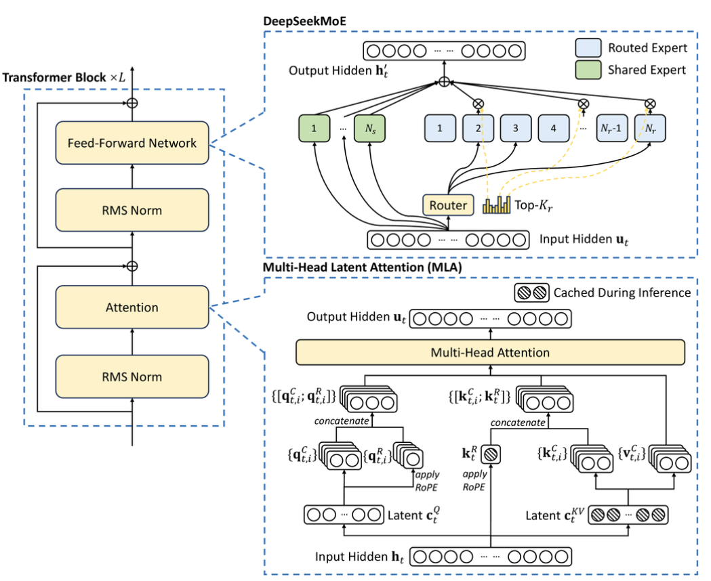
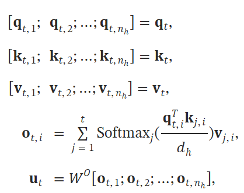
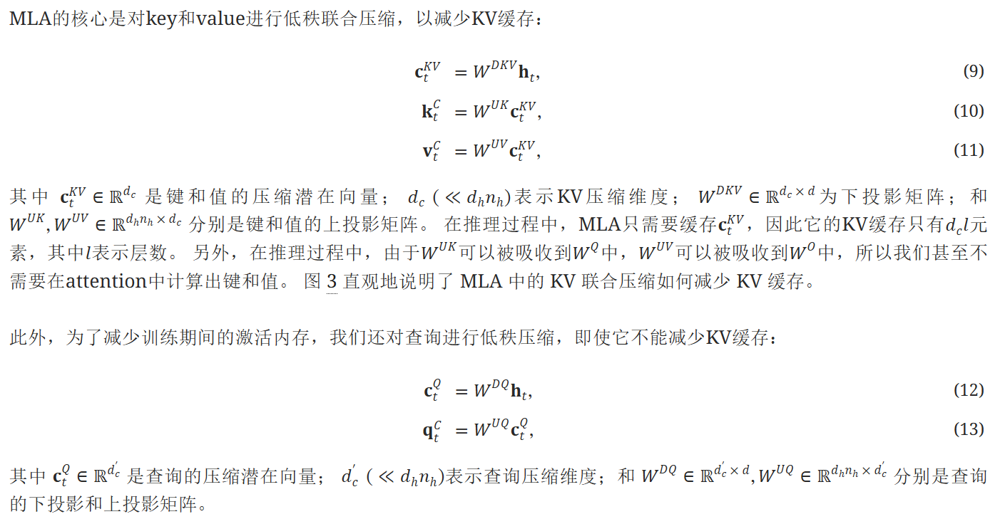
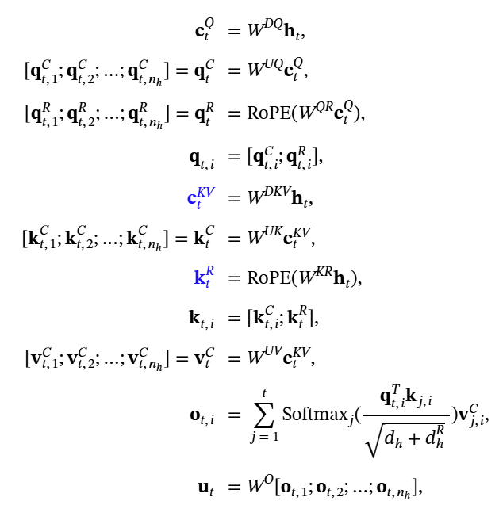
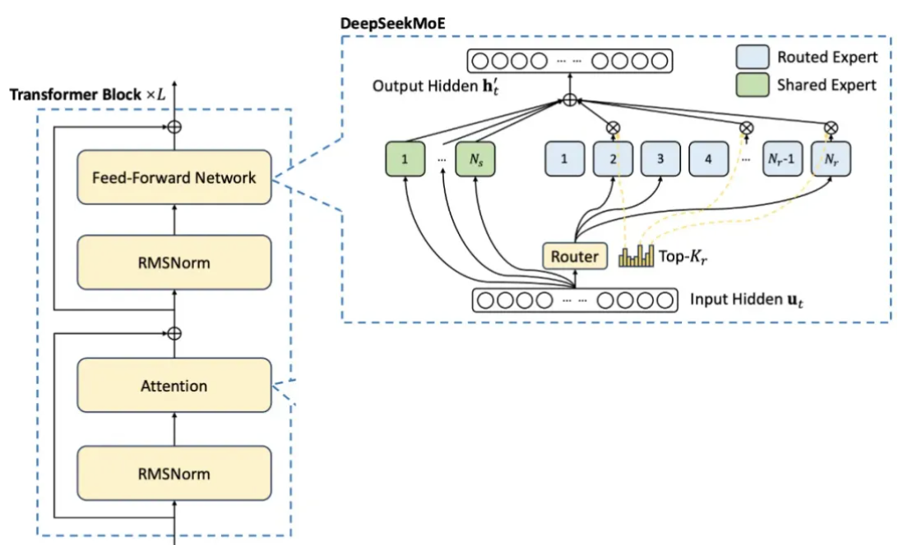
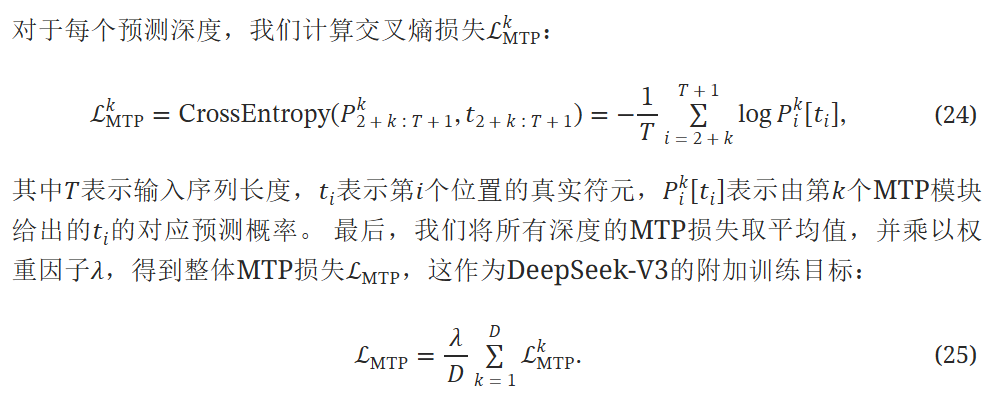

# 0 相关论文全汇总

**DeepSeek-V2**  

- [论文链接-EN](https://arxiv.org/pdf/2405.04434)
- [论文链接-CN](https://yiyibooks.cn/arxiv/2405.04434v5/index.html)

**DeepSeek-MOE**  

- [论文链接-EN](https://arxiv.org/pdf/2401.06066)
- [论文链接-CN](https://yiyibooks.cn/arxiv/2401.06066v1/index.html)

**DeepSeek-V3**  

- [论文链接-EN](https://arxiv.org/pdf/2412.19437)
- [论文链接-CN](https://yiyibooks.cn/arxiv/2412.19437v1/index.html)

**DeepSeek-R1**  

- [论文链接-EN](https://arxiv.org/pdf/2501.12948)
- [论文链接-CN](https://yiyibooks.cn/arxiv/2501.12948v1/index.html)

&nbsp;&nbsp;&nbsp;&nbsp;&nbsp;&nbsp;&nbsp;&nbsp;本文深入探讨了 DeepSeek-R1 模型架构。让我们从输入到输出追踪 DeepSeek-R1 模型，以找到架构中的新发展和关键部分。DeepSeek-R1 基于 DeepSeek-V3-Base 模型架构。本文旨在涵盖其设计的所有重要方面。 

# 1. 输入上下文长度

## 1.1 DeepSeek-R1 的输入上下文长度为 128K。

&nbsp;&nbsp;&nbsp;&nbsp;&nbsp;&nbsp;&nbsp;&nbsp;DeepSeek-R1 从其基础模型 DeepSeek-V3-Base 继承了 128K 上下文长度。最初，DeepSeek-V3 使用 4K 上下文长度进行预训练。然后，利用 **YaRN 技术**，通过两阶段上下文长度扩展，首先将其增加到 32K，然后扩展到 128K。 

## 1.2 什么是 YaRN？

YaRN（另一种 RoPE 扩展方法）是一种旨在有效扩展使用旋转位置嵌入 (RoPE)的大型语言模型 (LLM) 的上下文窗口的技术。RoPE 使用旋转矩阵对位置信息进行编码，而 YaRN 则修改这些旋转频率的缩放方式。它不是简单地推断频率（这通常会导致性能下降），而是平滑地插入和调整这些频率，从而能够更好地推广到更长的上下文。它在计算上是高效的，并且无需大量重新训练即可扩展模型上下文长度。

# 2. 总层数

**DeepSeek-R1** 包含以下结构：

DeepSeek-R1 由一个嵌入层、其后的 61 个变换器层以及输出阶段的多个预测头组成。

DeepSeek-R1 在所有 Transformer 层上采用多头潜在注意力 (MLA) 层，而不是标准多头注意力。前三个 Transformer 层与其他层不同，使用标准前馈网络 (FFN) 层。从第 4 层到第 61 层，混合专家 (MoE) 层取代了 FFN 层。MLA 和 MoE 的细节将在以下部分中探讨。 

带有维度的完整模型架构描述：

DeepSeek-V3使用多标记预测 (MTP) 技术，利用最后两个预测头预测接下来的2 个标记。第二个预测标记的接受率介于85% 和 90%之间，表明在各个生成主题中均具有很高的可靠性。 DeepSeek-R1 (DeepSeek-V3) 总共包含 671B 个参数，其中每个标记激活 37B 个。在这里插入图片描述.

# 3. 前 3 个 DeepSeek-R1 层

前 3 层由多头潜在注意力 (MLA) 和标准 FFN 层组成。这些通常被称为“密集 LLM 层”，因为 FFN 层不会被 MoE 层取代，相比之下 MoE 层被认为更稀疏。

---

# 4. DeepSeek-R1 的第 4 层至第 61 层

这些层由 MLA 层和 MoE 层组成。我们将在接下来的部分中了解什么是 MLA 层和 MoE 层以及它们如何工作。

## 5. Multi-Head Latent Attention: Boosting Inference Efficiency

## 5.1 introduction
传统的Transformer模型通常采用多头注意力（MHA）（Vaswani等人，2017），但在生成过程中，其繁重的Key-Value（KV）缓存将成为限制推理效率的瓶颈。 为了减少KV缓存，多查询注意力（MQA）（Shazeer，2019）和分组查询注意力（GQA）（Ainslie等人，2023）是建议的。 它们需要更小的 KV 缓存量，但它们的性能无法与 MHA 相匹配（我们在附录 D.1 中提供了 MHA、GQA 和 MQA 的消融研究）。

对于 DeepSeek-V2，我们设计了一种创新的注意力机制，称为多头潜在注意力（MLA）。 MLA 配备低秩键值联合压缩，比 MHA 具有更好的性能，但需要的 KV 缓存量要少得多。 我们将在下面介绍它的架构，并在附录 D.2 中提供 MLA 和 MHA 的比较。

## 5.2 Multi-Head  Attention (MHA)

## 5.3 Low-Rank Key-Value Joint Compression

## 5.4 解耦旋转位置嵌入

## 5.5 MLA 完整公式

## 5.6 缓存对比

## 5.7 W^{uk} 被 W^{Q} 吸收

## 5.8 RoRE 时W^{uk} 无法被 W^{Q} 吸收

# 6 DeepSeekMOE
在 DeepSeek 系列模型中，MoE 架构首次在 DeepSeekMoE 模型中引入，并且正在 DeepSeek-V2、DeepSeek-V3 和 DeepSeek-R1 中使用。

对于 FFN，我们采用 DeepSeekMoE 架构（Dai 等人，2024）。 DeepSeekMoE 有两个关键思想：将专家细分为更细的粒度，以实现更高的专家专业化和更准确的知识获取；以及隔离一些共享专家，以减轻路由专家之间的知识冗余。 在激活和总专家参数数量相同的情况下，DeepSeekMoE 可以大幅优于 GShard （Lepikhin 等人，2021） 等传统 MoE 架构。 

从本质上讲，MoE 遵循标准 Transformer 设计，但通过引入多个并行专家网络(FFN) 而不是单个密集 FFN来修改前馈层。其工作原理如下：

1. 多个 FFN（而非一个）

MoE 不使用单个共享的 FFN，而是使用多个并行训练的FFN 层（专家） 。 

2. 输入处理和令牌路由

每个 token 都像往常一样经过 transformer自注意力层。
它不是由单个 FFN 处理，而是被发送到路由器，由路由器决定哪些专家应该处理它。 

3. 通过路由器选择专家

一个小型的、可训练的路由器决定哪个专家子集（FFN）应该处理每个标记。
通常，每个 token仅选择 1 或 2 个专家以保持效率（例如， top-1 或 top-2 门控）。DeepSeek -V3（DeepSeek-R1）使用 9 个专家，其中 1 个是共享专家，其他 8 个是路由专家。
选择通常基于softmax 评分机制，其中路由器为每个专家分配概率。具体来说，在 DeepSeek-V3 (DeepSeek-R1) 中，使用 Sigmoid 而不是 softmax。 

4. 专家稀疏计算

只有选定的专家才能处理令牌，而其他人则保持不活动状态。
专家输出使用加权求和进行组合，并传递到下一个 Transformer 层。在 DeepSeek-V3/R1 中，权重是归一化的 S 型输出。
这种稀疏激活可确保任何时候仅使用模型的一小部分，从而保持计算可管理。 

## 6.1 为什么要用 MoE 取代单一 FFN？

- 可扩展性— MoE 允许模型使用更多参数进行扩展，而无需线性增加计算量。
- 高效学习— 专家专注于数据的不同方面，从而提高泛化能力。
- 计算节省— 由于每个 token 仅使用专家子集，因此与相同大小的密集模型相比，MoE 模型的运行成本更低。DeepSeek-V3/R1 共有 6710 亿个参数，其中每个 token 激活 370 亿个参数。

## 6.2 DeepSeekMoE 解读

### 6.2.1 基本架构

### 6.2.2 基于中心点的路由机制
传统MOE通常通过线性投影学习路由权重，而基于中心点的路由直接利用数据分布特性，减少参数依赖，提升可解释性。 

在 DeepSeekMoe 的路由机制中，中心点的确定通常结合了可学习参数与动态优化策略，以实现高效的专家分配。以下是其核心机制的逐步解释：

1. 可学习的中心点初始化
中心点（通常表示为向量）作为模型参数的一部分，**随机初始化**（如高斯分布或均匀分布）。每个专家对应一个唯一的中心点，初始时这些中心点在向量空间中均匀分布，确保覆盖潜在的输入表示范围。

2. 基于相似度的路由计算
输入 token 的嵌入向量（通过前置网络编码后）作为查询向量（query），与所有专家的中心点进行**相似度计算**（如点积、余弦相似度）。例如： 
$$
\text{相似度}_i = \frac{\mathbf{q} \cdot \mathbf{c}_i}{\|\mathbf{q}\| \|\mathbf{c}_i\|}
$$
其中，$\mathbf{q}$ 为查询向量，$\mathbf{c}_i$ 为第 $i$ 个专家的中心点。

3. 稀疏路由选择
仅选择相似度最高的前 \(k\) 个专家（如 \(k=1\) 或 \(k=2\)），确保计算的高效性。这一步骤通过 **Top-k 门控** 实现，例如：
$$
g_i = \begin{cases}
\frac{\exp(\mathbf{q}^T \mathbf{c}_i)}{\sum_{j \in \text{Top-k}} \exp(\mathbf{q}^T \mathbf{c}_j)} & \text{if } i \in \text{Top-k} \\
0 & \text{otherwise}
\end{cases}
$$

4. 中心点的动态优化
在训练过程中，中心点通过 **梯度下降** 自动调整，以最小化整体损失函数。反向传播时，路由机制的梯度会更新中心点，使其向更具代表性的输入区域移动。例如，若某专家频繁处理某一类输入，其中心点会逐渐靠近该类输入的均值方向。

5. 负载均衡与正则化
为防止某些专家被过度激活或闲置，DeepSeekMoe 可能引入 **负载均衡损失**（如重要性损失或专家多样性正则化），迫使中心点在向量空间中均匀分布。例如： 
$$
\mathcal{L}_{\text{balance}} = \lambda \sum_{i=1}^N \left( \text{importance}_i - \frac{1}{N} \right)^2
$$

其中 $\text{importance}_i$ 为第 \(i\) 个专家的激活频率，$\lambda$ 为平衡系数。

6. 自适应调整策略（可选）
在训练后期，可能采用 **动态中心点修剪或合并** 策略，移除冗余专家或合并相似中心点，进一步提升模型效率。

## 关键优势
- **端到端学习**：中心点与模型参数联合优化，无需依赖外部聚类算法。
- **稀疏性与效率**：Top-k 机制确保计算资源集中在最相关的专家。
- **自适应性**：通过负载均衡机制，自动调整专家分工，避免资源浪费。

这一机制在保持模型轻量化的同时，显著提升了任务处理的专业性和灵活性。

### 6.2.3 设备限制路由
我们设计了一种**设备限制的路由机制**来`限制 MoE 相关的通信成本`。 当采用专家并行时，路由专家将分布在多个设备上。 对于每个词符，其与MoE相关的通信频率与其目标专家覆盖的设备数量成正比。 由于DeepSeekMoE中的细粒度专家分割，`激活的专家数量可能很大`，因此如果我们应用专家并行性，MoE相关的通信成本将会更高。

对于 DeepSeek-V2，除了简单地选择路由专家的 top-K 之外，我们还确保`每个词符的目标专家将分布在最多M 台设备上`。 具体来说，对于每个词符，我们首先选择M 个设备中包含亲和力得分最高的专家。 然后，我们在这些M个设备上的专家中进行top-K选择。 在实践中，我们发现当M⩾3时，设备限制路由可以实现与不受限制的top-K路由大致一致的良好性能。

与DeepSeek-V2使用的设备限制路由类似，DeepSeek-V3也使用受限路由机制来限制训练期间的通信成本。 简而言之，我们确保每个符元最多会被发送到M个节点，这些节点根据每个节点上分布的专家最高 $\frac{K_r}{M}$个亲和力分数之和来选择。 在此约束下，我们的MoE训练框架几乎可以实现完全的计算-通信重叠。 

### 6.2.4 无辅助损失的负载均衡

### 6.2.5 补充的序列级辅助损失。

### 6.2.6 No Token-Dropping

由于有效的负载均衡策略，DeepSeek-V3在其整个训练过程中保持良好的负载平衡。 因此，DeepSeek-V3在训练过程中不会丢弃任何符元。 此外，我们还实现了特定的部署策略以确保推理负载平衡，因此DeepSeek-V3在推理过程中也不会丢弃符元。

# 7 多标记预测（MTP）

多标记预测是语言建模中的一种高级方法，其中模型不是一次预测一个序列中的下一个单词，而是同时预测多个未来标记。此方法使模型能够并行预测多个即将到来的单词，从而提高学习效率并加速文本生成。

Meta 引入了一种多标记预测架构，可训练语言模型同时预测多个未来标记，从而提高采样效率并加快推理速度。在此概念的基础上，DeepSeek-V3 整合了多标记预测 (MTP) 目标，使模型能够同时预测多个标记。这种方法使训练信号密集化，并能够更好地预先规划标记表示，从而提高复杂基准测试的性能。

## 7.1 DeepSeek-V3/R1 和 Meta 的多令牌预测有两个关键区别：
>“与 Gloeckle 等人（2024 年）[Meta Research] 使用独立输出头并行预测 𝐷 个额外标记不同，
>我们按顺序预测其他标记，并在每个预测深度保留完整的因果链。” — DeepSeek-V3

- Meta 的模型预测了4 个 token，而 DeepSeek-V3 预测了2 个 token。
- Meta 模型中的预测头是独立的，而 DeepSeek-V3 的预测头是顺序连接的。

## 7.2 MTP 在 DeepSeek-R1 中如何工作？

让我们一步一步地看一下该图表。

在训练期间，输入标记（位于左下角）穿过嵌入层，然后传播到所有变压器块/层。

第一个预测头（包括输出头）直接连接到主模型的最终 Transformer 层。输出头通常是前馈网络 (FFN)，其输出维度与模型的词汇量相匹配。该头负责按顺序预测下一个标记。给定输入标记t₁、t₂、t₃、t₄，它会预测t₂、t₃、t₄、t₅ 。但是，在推理过程中，只计算最终标记t₅ 。

第二个预测头通过添加额外的可学习层扩展了这种方法。它从主模型的最终 Transformer 层获取输出，应用 RMSNorm 进行归一化，然后将其与输入嵌入连接起来。这些输入嵌入是从主模型中使用的相同嵌入层获得的。与第一个预测头不同，这个头从t₂而不是t₁开始处理输入标记。然后使用线性投影层将连接的输出投影到合适的嵌入大小，然后使用可学习的 Transformer 块/层进行进一步处理。在训练期间，这个头将t₃预测为t₆，但在推理中，只计算t₆ 。

类似地，第三个预测头从第二个预测头的transformer器块/层获取输入以及相应的输入嵌入，现在从t₃开始到t₆。它遵循与前几个头相同的结构，在训练期间预测t₄到t₇，但在推理期间仅计算t₇。

每个预测头使用交叉熵计算损失。然后，这些损失用因子λ加权，取其平均值作为最终损失值。

## 7.3 推理中的MTP。
我们的MTP策略主要旨在提高主模型的性能，因此在推理过程中，我们可以直接丢弃MTP模块，主模型可以独立正常运行。 此外，我们还可以将这些MTP模块重新用于推测性解码，以进一步提高生成延迟。

# 8 DualPipe和计算-通信重叠
DeepSeek-V3的训练由HAI-LLM框架支持，这是一个由我们的工程师从头开始构建的高效轻量级训练框架。 总的来说，DeepSeek-V3应用了16路流水线并行（PP）(Qi et al., 2023a)，跨越8个节点的64路专家并行（EP）(Lepikhin et al., 2021)，以及ZeRO-1数据并行（DP）(Rajbhandari et al., 2020)。 

为了促进DeepSeek-V3的高效训练，我们实现了细致的工程优化。 首先，我们设计了用于高效流水线并行的DualPipe算法。 与现有的流水线并行方法相比，DualPipe的流水线气泡更少。 更重要的是，它重叠了前向和后向过程中的计算和通信阶段，从而解决了跨节点专家并行引入的沉重通信开销的挑战。 其次，我们开发了高效的跨节点全对全通信内核，以充分利用IB和NVLink带宽，并节省专门用于通信的流多处理器 (SM)。 最后，我们仔细优化了训练期间的内存占用，从而使我们能够在不使用代价高昂的张量并行 (TP) 的情况下训练DeepSeek-V3。 

https://mp.weixin.qq.com/s/yh1QkFTc4FaRMtSWdbncbQ