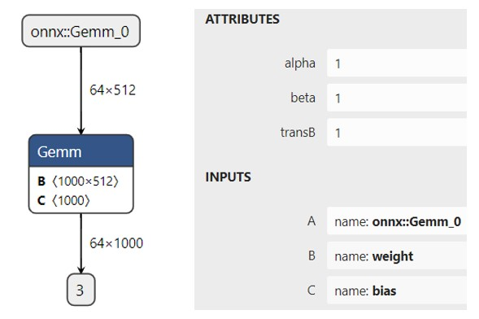
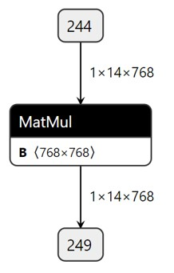
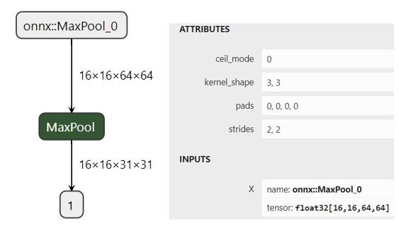
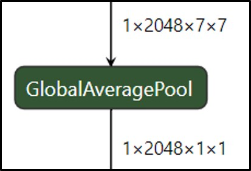

# 0 深度学习模型认识
- [深度学习预训练模型下载](https://github.com/onnx/models)
- [深度学习模型可视化](https://netron.app/)

**==============  深度学习常用算子 ==============**

# 1 Convolution
## 1.1 Conv2D
- 示意图<br>


- [pytorch 实现](https://pytorch.org/docs/stable/generated/torch.nn.Conv2d.html#torch.nn.Conv2d)
```python
import torch.nn as nn
# With square kernels and equal stride
m = nn.Conv2d(16, 33, 3, stride=2)
# non-square kernels and unequal stride and with padding
m = nn.Conv2d(16, 33, (3, 5), stride=(2, 1), padding=(4, 2))
# non-square kernels and unequal stride and with padding and dilation
m = nn.Conv2d(16, 33, (3, 5), stride=(2, 1), padding=(4, 2), dilation=(3, 1))
input = torch.randn(20, 16, 50, 100)
output = m(input)
```

## 1.2 ConvTranspose2d
- 图示 <br>


- [pytorch 实现](https://pytorch.org/docs/stable/generated/torch.nn.ConvTranspose2d.html#torch.nn.ConvTranspose2d)

```python
import torch
import torch.nn as nn
# With square kernels and equal stride
m = nn.ConvTranspose2d(16, 33, 3, stride=2)
# non-square kernels and unequal stride and with padding
m = nn.ConvTranspose2d(16, 33, (3, 5), stride=(2, 1), padding=(4, 2))
input = torch.randn(20, 16, 50, 100)
output = m(input)
# exact output size can be also specified as an argument
input = torch.randn(1, 16, 12, 12)
downsample = nn.Conv2d(16, 16, 3, stride=2, padding=1)
upsample = nn.ConvTranspose2d(16, 16, 3, stride=2, padding=1)
h = downsample(input)
h.size()

output = upsample(h, output_size=input.size())
output.size()
```

# 2 线性变换层
## 2.1 Linear/Gemm
**图示** <br>


[pytorch 实现](https://pytorch.org/docs/stable/generated/torch.nn.Linear.html#torch.nn.Linear)
```python
import torch.nn as nn
m = nn.Linear(20, 30)
input = torch.randn(128, 20)
output = m(input)
print(output.size())
```

## 2.2 matmul 相关
**图示** <br>


**pytorch中有三个相似的矩阵操作** <br>
- matmul是通用的矩阵乘法函数，适用于不同维度的输入。
- bmm是用于批量矩阵乘法的函数，要求输入为3维张量。
- mm是用于两个二维矩阵乘法的函数，要求输入为2维张量。

```python
import torch
tensor1 = torch.randn(10, 3, 4)
tensor2 = torch.randn(10, 4, 5)
torch.matmul(tensor1, tensor2).size()

mat1 = torch.randn(2, 3)
mat2 = torch.randn(3, 3)
torch.mm(mat1, mat2)

input = torch.randn(10, 3, 4)
mat2 = torch.randn(10, 4, 5)
res = torch.bmm(input, mat2)
res.size()
```

# 3 Normalization
**几种Normalization 对比** <br>


##  3.1 BatchNorm2d
**BN示意图** <br>


**原理:** <br>
- batchNorm是在batch上，对NHW做归一化;即是将同一个batch中的所有样本的同一层特征图抽出来一起求mean和variance。<br>
- 但是当batch size较小时(小于16时)，效果会变差，这时使用group norm可能得到的效果会更好;
- 加入缩放和平移变量，改变数据分布的均值和方差；

**作用**：<br>
- 首先，在进行训练之前，一般要对数据做归一化，使其分布一致,防止因输入数据分布变化对结果产生影响；
- 其次在网络中间，使用Batchnorm，将数据拉回到正态分布，加快收敛速度，防止梯度消失；
- 加入缩放和平移变量的原因是：保证每一次数据经过归一化后还保留原有学习来的特征，同时又能完成归一化操作，加速训练。 这两个参数是用来学习的参数。

**思考：在训练和推理时有何不同？？？**

- [pytorch 实现](https://pytorch.org/docs/stable/generated/torch.nn.BatchNorm2d.html#torch.nn.BatchNorm2d)
```python
# With Learnable Parameters
m = nn.BatchNorm2d(100)
# Without Learnable Parameters
m = nn.BatchNorm2d(100, affine=False)
input = torch.randn(20, 100, 35, 45)
output = m(input)
```

**手动实现** <br>
```python
import numpy as np
def Batchnorm(x, gamma, beta, bn_param):
    # x_shape:[B, C, H, W]
    running_mean = bn_param['running_mean']
    running_var = bn_param['running_var']
    results = 0.
    eps = 1e-5

    x_mean = np.mean(x, axis=(0, 2, 3), keepdims=True)
    x_var = np.var(x, axis=(0, 2, 3), keepdims=True0)
    x_normalized = (x - x_mean) / np.sqrt(x_var + eps)
    results = gamma * x_normalized + beta

    # 因为在测试时是单个图片测试，这里保留训练时的均值和方差，用在后面测试时用
    running_mean = momentum * running_mean + (1 - momentum) * x_mean
    running_var = momentum * running_var + (1 - momentum) * x_var

    bn_param['running_mean'] = running_mean
    bn_param['running_var'] = running_var

    return results, bn_param
```

- [论文链接](https://arxiv.org/pdf/1502.03167.pdf)

## 3.2 LayerNorm
**LN 简述** <br>
- BN不适用于深度不固定的网络（如 RNN 中的sequence长度），而LayerNorm对深度网络的某一层的所有神经元进行标准化操作，非常适合用于序列化输入。<br>
- LN一般只用于RNN的场景下，在CNN中LN规范化效果不如BN,GN,IN。

**BN 和 LN 的区别** <br>
1. LN中同层神经元输入拥有相同的均值和方差，不同的输入样本有不同的均值和方差；
2. BN中则针对不同神经元输入计算均值和方差，同一个batch中的输入拥有相同的均值和方差。
3. 所以，LN不依赖于batch的大小和输入sequence的深度，因此可以用于batchsize为1和RNN中对边长的输入sequence的normalize操作。
   
- [pytorch 实现](https://pytorch.org/docs/stable/generated/torch.nn.LayerNorm.html#torch.nn.LayerNorm)
```python
import torch
import torch.nn as nn
batch, sentence_length, embedding_dim = 20, 5, 10
embedding = torch.randn(batch, sentence_length, embedding_dim)
layer_norm = nn.LayerNorm(embedding_dim)
# Activate module
output = layer_norm(embedding)
```

**手动实现** <br>
```python
def ln(x, b, s):
    _eps = 1e-5
    output = (x - x.mean(1)[:,None]) / tensor.sqrt((x.var(1)[:,None] + _eps))
    output = s[None, :] * output + b[None,:]
    return output

# 用于图像上
def Layernorm(x, gamma, beta):
    # x_shape:[B, C, H, W]
    results = 0.
    eps = 1e-5

    x_mean = np.mean(x, axis=(1, 2, 3), keepdims=True)
    x_var = np.var(x, axis=(1, 2, 3), keepdims=True0)
    x_normalized = (x - x_mean) / np.sqrt(x_var + eps)
    results = gamma * x_normalized + beta
    return results
```

- [论文链接](https://arxiv.org/pdf/1607.06450v1.pdf)

## 3.3 Instance Normalization
**简述** <br>
- BN注重对每个batch进行归一化，保证数据分布一致，因为判别模型中结果取决于数据整体分布。
- 但是图像风格化中，生成结果主要依赖于某个图像实例，所以对整个batch归一化不适合图像风格化中，因而对HW做归一化。可以加速模型收敛，并且保持每个图像实例之间的独立。

- [pytorch 实现](https://pytorch.org/docs/stable/generated/torch.nn.InstanceNorm2d.html#torch.nn.InstanceNorm2d)
```python
# Without Learnable Parameters
m = nn.InstanceNorm2d(100)
# With Learnable Parameters
m = nn.InstanceNorm2d(100, affine=True)
input = torch.randn(20, 100, 35, 45)
output = m(input)
```

**手动实现** <br>
```python
def Instancenorm(x, gamma, beta):
    # x_shape:[B, C, H, W]
    results = 0.
    eps = 1e-5

    x_mean = np.mean(x, axis=(2, 3), keepdims=True)
    x_var = np.var(x, axis=(2, 3), keepdims=True0)
    x_normalized = (x - x_mean) / np.sqrt(x_var + eps)
    results = gamma * x_normalized + beta
    return results
```
[Instance 论文链接](https://arxiv.org/pdf/1607.08022.pdf)

## 3.4  Group Normalization
**原理** <br>
&nbsp;&nbsp;&nbsp;&nbsp;&nbsp;&nbsp;&nbsp;&nbsp;主要是针对Batch Normalization对小batchsize效果差，GN将channel方向分group，然后每个group内做归一化，算(C//G)*H*W的均值，这样与batchsize无关，不受其约束。<br>

[pytorch 实现](https://pytorch.org/docs/stable/generated/torch.nn.GroupNorm.html#torch.nn.GroupNorm)
```python
input = torch.randn(20, 6, 10, 10)
# Separate 6 channels into 3 groups
m = nn.GroupNorm(3, 6)
# Separate 6 channels into 6 groups (equivalent with InstanceNorm)
m = nn.GroupNorm(6, 6)
# Put all 6 channels into a single group (equivalent with LayerNorm)
m = nn.GroupNorm(1, 6)
# Activating the module
output = m(input)
```

**手动实现** <br>
```python
def GroupNorm(x, gamma, beta, G=16):
    # x_shape:[B, C, H, W]
    results = 0.
    eps = 1e-5
    x = np.reshape(x, (x.shape[0], G, x.shape[1]/16, x.shape[2], x.shape[3]))

    x_mean = np.mean(x, axis=(2, 3, 4), keepdims=True)
    x_var = np.var(x, axis=(2, 3, 4), keepdims=True0)
    x_normalized = (x - x_mean) / np.sqrt(x_var + eps)
    results = gamma * x_normalized + beta
    return results
```

# 4 Pooling
&nbsp;&nbsp;&nbsp;&nbsp;&nbsp;&nbsp;&nbsp;&nbsp;Pooling(池化)是CNN 中常用的操作，通过在特定区域内对特征进行(reduce)来实现的。<br>

**作用** <br>
- 增大网络感受野
- 减小特征图尺寸，但保留重要的特征信息
- 抑制噪声，降低信息冗余
- 降低模型计算量，降低网络优化难度，防止网络过拟合
- 使模型对输入图像中的特征位置变化更加鲁棒

## 4.1 Max Pooling
**原理** <br>
&nbsp;&nbsp;&nbsp;&nbsp;&nbsp;&nbsp;&nbsp;&nbsp;最大池化在每个池化窗口中选择最大的特征值作为输出，提取特征图中响应最强烈的部分进入下一层; <br>




**作用** <br>
&nbsp;&nbsp;&nbsp;&nbsp;&nbsp;&nbsp;&nbsp;&nbsp;这种方式摒弃了网络中大量的冗余信息，使得网络更容易被优化。同时这种操作方式也常常丢失了一些特征图中的细节信息，所以最大池化更多保留些图像的纹理信息。<br>

[pytorch 实现](https://pytorch.org/docs/stable/generated/torch.nn.MaxPool2d.html#torch.nn.MaxPool2d)
```python
import torch.nn as nn
# pool of square window of size=3, stride=2
m = nn.MaxPool2d(3, stride=2)
# pool of non-square window
m = nn.MaxPool2d((3, 2), stride=(2, 1))
input = torch.randn(20, 16, 50, 32)
output = m(input)
```

## 4.2 AveragePooling
&nbsp;&nbsp;&nbsp;&nbsp;&nbsp;&nbsp;&nbsp;&nbsp;平均池化在每个池化窗口中选择特征值的平均值作为输出，这有助于保留整体特征信息，可以更多的保留图像的背景信息，但可能会丢失一些细节。<br>

[pytorch 实现](https://pytorch.org/docs/stable/generated/torch.nn.AvgPool2d.html#torch.nn.AvgPool2d)
```python
import torch.nn as nn
# pool of square window of size=3, stride=2
m = nn.AvgPool2d(3, stride=2)
# pool of non-square window
m = nn.AvgPool2d((3, 2), stride=(2, 1))
input = torch.randn(20, 16, 50, 32)
output = m(input)
```

## 4.3 Global Average Pooling


**背景** <br>
&nbsp;&nbsp;&nbsp;&nbsp;&nbsp;&nbsp;&nbsp;&nbsp;在卷积神经网络训练初期，卷积层通过池化层后一般要接多个全连接层进行降维，最后再Softmax分类，这种做法使得全连接层参数很多，降低了网络训练速度，且容易出现过拟合的情况。在这种背景下，M Lin等人提出使用全局平均池化Global Average Pooling[1]来取代最后的全连接层。用很小的计算代价实现了降维，更重要的是GAP极大减少了网络参数(CNN网络中全连接层占据了很大的参数)。<br>

**实现原理** <br>
&nbsp;&nbsp;&nbsp;&nbsp;&nbsp;&nbsp;&nbsp;&nbsp;全局平均池化是在整个特征图上计算特征值的平均值，然后将结果作为一个特征向量输出到下一层，这种池化方法通常在网络最后。<br>

**作用** <br>
&nbsp;&nbsp;&nbsp;&nbsp;&nbsp;&nbsp;&nbsp;&nbsp;作为全连接层的替代操作，GAP对整个网络在结构上做正则化防止过拟合，直接剔除了全连接层中黑箱的特征，直接赋予了每个channel实际的类别意义。除此之外，使用GAP代替全连接层，可以实现任意图像大小的输入，而GAP对整个特征图求平均值，也可以用来提取全局上下文信息，全局信息作为指导进一步增强网络性能。<br>

[pytorch 实现](https://pytorch.org/docs/stable/generated/torch.nn.AdaptiveAvgPool2d.html#torch.nn.AdaptiveAvgPool2d)
```python
import torch
import torch.nn as nn
# target output size of 5x7
m = nn.AdaptiveAvgPool2d((5, 7))
input = torch.randn(1, 64, 8, 9)
output = m(input)
# target output size of 7x7 (square)
m = nn.AdaptiveAvgPool2d(7)
input = torch.randn(1, 64, 10, 9)
output = m(input)
# target output size of 10x7
m = nn.AdaptiveAvgPool2d((None, 7))
input = torch.randn(1, 64, 10, 9)
output = m(input)
```
- [GlobalAvgPool 论文链接](https://arxiv.org/pdf/1312.4400.pdf%20http://arxiv.org/abs/1312.4400.pdf)

# 5 Activation
**线性神经网络的问题** <br>
&nbsp;&nbsp;&nbsp;&nbsp;&nbsp;&nbsp;&nbsp;&nbsp;全连接层或CNN只是对数据做仿射变换（affine transformation), 多个仿射变换叠加仍是一个仿射变换, 即便再添加更多的隐藏层，依然只能与仅含输出层的单层神经网络等价!<br>
*注释：(仿射变换 :  在几何中, 一个向量空间进行一次线性变换并接上一个平移, 变换为另一个向量空间).* <br>

**解决思路：** <br>
&nbsp;&nbsp;&nbsp;&nbsp;&nbsp;&nbsp;&nbsp;&nbsp;可以通过引入非线性变换，对线性层的输出用 Pointwise 类型的非线性函数进行变换，然后再作为下一个层的输入 来解决线性网络表达能力不足的问题。这个非线性函数被称为激活函数（activation function）。<br>

**总结：** <br>
&nbsp;&nbsp;&nbsp;&nbsp;&nbsp;&nbsp;&nbsp;&nbsp;激活函数可以看作卷积神经网络模型中一个特殊的层，即非线性映射层。卷积神经网络在进行完线性变换后，都会在后边叠加一个非线性的激活函数，在非线性激活函数的作用下数据分布进行再映射，以增加卷积神经网络的非线性表达能力。<br>

**激活函数应该具有什么样的性质：** <br>
- 非线性：即导数不是常数。保证多层网络不退化成单层线性网络。
- 可微性：保证了在优化中梯度的可计算性。虽然 ReLU 存在有限个点处不可微，但处处 subgradient，可以替代梯度。
- 计算简单：激活函数复杂就会降低计算速度，因此 RELU 要比 Exp 等操作的激活函数更受欢迎。
- 非饱和性（saturation）：饱和指的是在某些区间梯度接近于零（即梯度消失），使得参数无法继续更新的问题。最经典的例子是 Sigmoid，它的导数在 x 为比较大的正值和比较小的负值时都会接近于 0。RELU 对于 x<0，其梯度恒为 0，这时候它也会出现饱和的现象。Leaky ReLU 和 PReLU 的提出正是为了解决这一问题。
- 单调性（monotonic）：即导数符号不变。当激活函数是单调的时候，单层网络能够保证是凸函数。但是激活函数如 mish 等并不满足单调的条件，因此单调性并不是硬性条件，因为神经网络本来就是非凸的。
- 参数少：大部分激活函数都是没有参数的。像 PReLU 带单个参数会略微增加网络的大小。

**Zero-centered ???:** <br>
&nbsp;&nbsp;&nbsp;&nbsp;&nbsp;&nbsp;&nbsp;&nbsp;Zero-centered激活函数指的是在激活函数的输出中心值为零（例如，均值为零）。相比于非零中心的激活函数（例如ReLU），零中心激活函数在某些情况下**可能**具有一些优势，但**并不一定**在所有情况下都表现更好。<br>

&nbsp;&nbsp;&nbsp;&nbsp;&nbsp;&nbsp;&nbsp;&nbsp;以下是一些与零中心激活函数相关的考虑因素：<br>
- 梯度传播：在**某些**情况下，零中心激活函数可以更好地支持梯度传播。由于零中心激活函数的输出均值为零，可以更容易地保持梯度的一致性，**有助于**网络的收敛和训练。
- 表示能力：一些研究表明，零中心激活函数可以提供更好的网络表示能力。通过将正负值均匀分布在激活函数的输出范围内，零中心激活函数可以更好地捕捉数据中的不同特征。
- 对称性：零中心激活函数具有对称性，这**可能**对某些任务和网络架构更有利。在某些情况下，对称性可以提高网络的稳定性和泛化能力。

*注释：保持梯度一致性指的是在深度神经网络中，通过网络的层级传播梯度时，尽量保持梯度的大小和方向保持一致，避免梯度在传播过程中出现过大或过小的变化。*

&nbsp;&nbsp;&nbsp;&nbsp;&nbsp;&nbsp;&nbsp;&nbsp;然而，需要注意的是，**并非**所有的任务和网络都能从零中心激活函数中受益。在某些情况下，非零中心的激活函数（如ReLU）可能表现**更好**。例如，ReLU可以**更好地**处理稀疏激活和非线性特征。此外，通过使用批归一化等技术，非零中心激活函数的不足也可以在一定程度上**被缓解**。<br>
&nbsp;&nbsp;&nbsp;&nbsp;&nbsp;&nbsp;&nbsp;&nbsp;综上所述，零中心激活函数**并非**在所有情况下都具有更好的性能。选择激活函数时，需要根据具体任务、网络架构和数据特征进行评估和实验，以找到最适合的激活函数。<br>

## 5.1 S 型激活函数
&nbsp;&nbsp;&nbsp;&nbsp;&nbsp;&nbsp;&nbsp;&nbsp;在深度学习发展初期，传统 S 型非线性饱和激活函数 sigmoid 和 tanh 函数得到了广泛的应用。<br>

**数学公式：** <br> 

$$sigmoid(x) = \frac{1}{1 + e^{-x}}$$

$$ tanh(x) = \frac{e^{x} - e^{-x}}{e^{x} + e^{-x}} $$

**对应的导函数：** <br>

$$\frac{dsigmoid}{dx} = sigmoid(x)(1-sigmoid(x))$$

$$\frac{dtanh}{dx} = 1 - tanh^{2}$$

**函数图如下：** <br>


**S型激活函数分析** <br>
- 由上图(左)可知 ：sigmoid 激活函数值的范围为（0，1），经过它激活得到的数据为非 0 均值；sigmoid 激活函数具有双向饱和性，即在一定数据范围内，其导数收敛于 0 。
- 由上图(右)可知：sigmoid 激活函数导数范围为（0，0.25），且不在（−3，3）的数据导数值很小，在反向传播过程时，导数相乘很容易造成梯度弥散；
- 另外，sigmoid 激活函数求导过程计算量较大，模型训练的时间复杂度较高。
- 由上图左右对比可知：tanh 激活函数解决了 sigmoid 激活函数非 0 均值的问题，且其导数范围为（0，1），从而略微缓减了sigmoid 激活函数梯度弥散的问题；
- 但 tanh 激活函数存在的双向饱和性仍然使得梯度弥散问题存在，且模型训练的时间复杂度较高。

[pytorch 实现](https://pytorch.org/docs/stable/generated/torch.nn.Sigmoid.html#torch.nn.Sigmoid)
```python
import torch.nn as nn
m = nn.Sigmoid()
input = torch.randn(2)
output = m(input)
```

[tanh pytorch 实现](https://pytorch.org/docs/stable/generated/torch.nn.Tanh.html#torch.nn.Tanh)
```python
m = nn.Tanh()
input = torch.randn(2)
output = m(input)
```

## 5.2 Relu 激活函数
**概念：** <br>
&nbsp;&nbsp;&nbsp;&nbsp;&nbsp;&nbsp;&nbsp;&nbsp;整流线性单位函数（Rectified Linear Unit, ReLU），又称修正线性单元，是一种人工神经网络中常用的激励函数（activation function），通常指代以斜坡函数及其变种为代表的非线性函数。<br>

**背景** <br>
&nbsp;&nbsp;&nbsp;&nbsp;&nbsp;&nbsp;&nbsp;&nbsp;2010 年，Hinton 首次提出了修正线性单元(rectified linear units，ReLU）作为激活函数。Krizhevsky 等在 2012 年 ImageNet ILSVRC 比赛中使用了激活函数 ReLU。在该比赛中，Krizhevsky等人提出了一种名为AlexNet的深度卷积神经网络架构，该网络结构包含了多个卷积层和全连接层。其中，ReLU被用作卷积层和全连接层之间的激活函数。在图像分类任务上获得了**远远超过**其他参赛者的结果，将错误率降低到了当时的最低水平。这一突破被认为是深度学习在计算机视觉领域的重要里程碑，引发了深度学习在各个领域的广泛应用和发展。<br>

**优势：** <br>
1. 不会发生梯度消失问题。Sigmoid函数在  x>0  会发生梯度消失问题，造成信息损失，从而无法完成深度网络的训练。而 ReLU 函数当  x>0  为线性结构，有固定的梯度，不会消失。
2. ReLU激活函数在  x<0  时会输出为 0 (失活)，这可以造成网络的稀疏性。这样可以很好的模拟人脑神经元工作的原理，且可以减少参数间的相互依赖，缓解了过拟合问题的发生。
3. Sigmoid函数复杂，计算量大 (前向传播+反向传播求导)，速度慢；而ReLU函数简单，计算量小，速度快。

*(注释：人类大脑神经元大约只有  1 \%-4 \%  是在同一时间工作的。从信号方面来看，即神经元同时只对输入信号的少部分选择性响应，大量信号被刻意的屏蔽了，这样可以提高学习的精度，更好更快地提取稀疏特征。)*

**缺点：** <br>
1. 由于激活函数是没有上界的，有可能出现神经网络输出为  \mathrm{NaN}  的情况
2. (重要) ReLU在训练的时候很"脆弱"，很可能产生 Dead ReLU Problem（神经元坏死现象）：某些神经元可能永远不会被激活，导致相应参数永远不会被更新（在负数部分，梯度为 0 )。
*（eg:由于ReLU在  x<0  时梯度为 0 ，这样就导致负的梯度在这个ReLU被置零，而且这个神经元有可能再也不会被任何数据激活。如果这个情况发生了，那么这个神经元之后的梯度就永远是0了，也就是 ReLU神经元坏死了, 不再对任何数据有所响应。)* <br>
3. ReLU不会对数据做幅度压缩，所以数据的幅度会随着模型层数的增加不断扩张。
4. ReLU的输出不是zero-centered；

**计算公式为：** <br>

$$ReLU(x)=max(0,x)$$

**对应图像和导函数图像为：** <br>


[pytorch 实现](https://pytorch.org/docs/stable/generated/torch.nn.ReLU.html#torch.nn.ReLU)
```python
m = nn.ReLU()
input = torch.randn(2)
output = m(input)

# An implementation of CReLU - https://arxiv.org/abs/1603.05201

m = nn.ReLU()
input = torch.randn(2).unsqueeze(0)
output = torch.cat((m(input), m(-input)))
```

[ReLU 论文链接](https://proceedings.mlr.press/v15/glorot11a/glorot11a.pdf)

## 5.3 ReLU6 
**稀疏性再述** <br>
&nbsp;&nbsp;&nbsp;&nbsp;&nbsp;&nbsp;&nbsp;&nbsp;ReLU 的稀疏性给卷积神经网络的训练带来了巨大的成功。从生物学上看，大脑同时被激活的神经元只有1%～4%，进一步表明神经元工作的稀疏性。神经元只对输入信号的少部分选择性响应，大量信号被刻意的屏蔽。类似神经元信号传播，在一定模型下，ReLU 的稀疏性可以提高学习的精度。然而传统的sigmoid 激活函数几乎同时有一半的神经元被激活，这和神经科学的研究不太相符，可能会给深度网络训练带来潜在的问题。<br>

**稀疏连接图示：** <br>


**ReLU6 概念** <br>
&nbsp;&nbsp;&nbsp;&nbsp;&nbsp;&nbsp;&nbsp;&nbsp;在深度学习中，有研究者尝试使用ReLU6 激活函数。ReLU6 是在ReLU 激活函数的基础上将大于6 的数据部分置为0，以进一步提高连接的稀疏性。<br>

**ReLU6 公式** <br>
$$ReLU(x)=min(max(0,x), 6)$$

**ReLU6 图示** <br>


[pytorch 实现](https://pytorch.org/docs/stable/generated/torch.nn.ReLU6.html#torch.nn.ReLU6)
```python
m = nn.ReLU6()
input = torch.randn(2)
output = m(input)
```

## 5.4 其它ReLU 相关 激活函数
&nbsp;&nbsp;&nbsp;&nbsp;&nbsp;&nbsp;&nbsp;&nbsp;为了解决Relu 负半轴“神经元坏死”的情况，研究者们对ReLU 的负半轴下功夫改造，提出了LeakyReLU（ leaky rectified linear unit） 、PReLU（ parametric rectified linear unit） 、RReLU（ randomized leaky rectified linear unit）等激活函数。<br>

**对应公式如下** <br>


**图示** <br>


[pytorch Leakey Relu](https://pytorch.org/docs/stable/generated/torch.nn.LeakyReLU.html#torch.nn.LeakyReLU)
```python
m = nn.LeakyReLU(0.1)
input = torch.randn(2)
output = m(input)
```

[pytorch PReLU](https://pytorch.org/docs/stable/generated/torch.nn.PReLU.html#torch.nn.PReLU)
```python
m = nn.PReLU()
input = torch.randn(2)
output = m(input)
```

[pytorch RReLU](https://pytorch.org/docs/stable/generated/torch.nn.RReLU.html#torch.nn.RReLU)
```python
m = nn.RReLU(0.1, 0.3)
input = torch.randn(2)
output = m(input)
```
[RReLU 论文](https://arxiv.org/pdf/1505.00853.pdf)

## 5.5 ELU(Exponential Linear Units) 和 SELU(Scaled ELU)
&nbsp;&nbsp;&nbsp;&nbsp;&nbsp;&nbsp;&nbsp;&nbsp;ELU 激活函数的正半轴与ReLU 激活函数保持一致，对负半轴引入软饱和以代替置“0”。ELU 激活函数在正半轴具有与ReLU 激活函数一样的优势，同时引入了负半轴的定义使得**整体输出均值接近0**。与LeakyReLU 和PReLU 相比，虽同样都是激活了负半轴，但ELU 的负半轴为软饱和区，斜率具有衰减性，这使得其对噪声有一些鲁棒性。同时，参数控制着函数的斜率变化。<br>

**公式如下：** <br>


**图像如下：** <br>


**效果** <br>
当 $\lambda \approx 1.0507;  \alpha \approx 1.6732$ 时，且weight正态分布时，各层输出近似正态分布，消除梯度消失和爆炸，让结构简单的网络甚至超过sota性能.<br>

[pytorch ELU 实现](https://pytorch.org/docs/stable/generated/torch.nn.ELU.html#torch.nn.ELU)
```python
m = nn.ELU()
input = torch.randn(2)
output = m(input)
```
[ELU 论文](https://arxiv.org/abs/1511.07289)

[pytorch SELU 实现](https://pytorch.org/docs/stable/generated/torch.nn.SELU.html#torch.nn.SELU)
```python
m = nn.SELU()
input = torch.randn(2)
output = m(input)
```
[SELU 论文](https://arxiv.org/abs/1706.02515)

## 5.6 GeLU
https://www.jiqizhixin.com/articles/2019-12-30-4
[GeLU 论文链接](https://arxiv.org/pdf/1606.08415.pdf)

## 5.7 Swish、Hardswish、mish

**公式：** <br>

$$Swish(x)=x \cdot sigmoid(\beta x)$$

**图像** <br>


[pytorch Hardswish 实现](https://pytorch.org/docs/stable/generated/torch.nn.Hardswish.html#torch.nn.Hardswish)
```python
m = nn.Hardswish()
input = torch.randn(2)
output = m(input)
```

## 5.8 激活函数图像汇总
[Activation 可视化](https://dashee87.github.io/deep%20learning/visualising-activation-functions-in-neural-networks/)


# 10 附录
- [onnx 算子列表](https://github.com/onnx/onnx/blob/main/docs/Operators.md)
- [pytorch 算子列表](https://pytorch.org/docs/stable/nn.html)

# 11 参考链接
- [激活函数汇总](http://spytensor.com/index.php/archives/23/?xqrspi=xnemo1)
- [激活函数综述](https://www.xhuqk.com/xhdxxbzkb/article/doi/10.12198/j.issn.1673-159X.3761)


  
