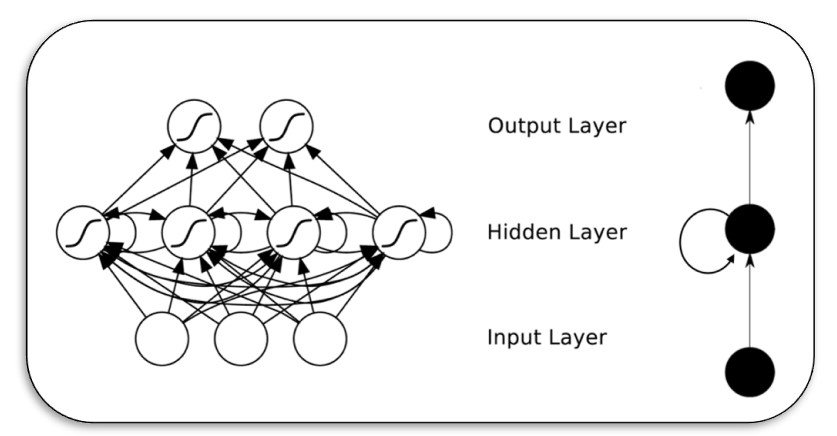
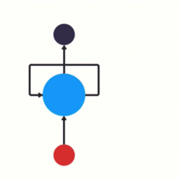
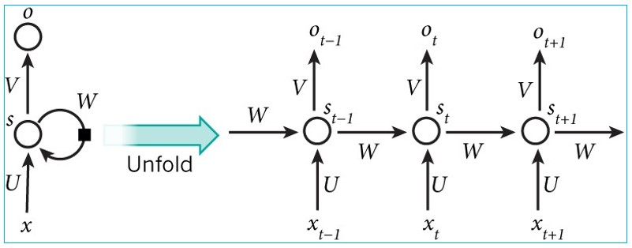

# 0 循环神经网络(Recurrent neural network：RNN)
&nbsp;&nbsp;&nbsp;&nbsp;&nbsp;&nbsp;&nbsp;&nbsp;循环神经网络(RNN)是前馈神经网络在处理序列数据时的一种**自然推广**。 

&nbsp;&nbsp;&nbsp;&nbsp;&nbsp;&nbsp;&nbsp;&nbsp;就像卷积网络是专门用于处理网格化数据（如一个图像）的神经网络，图像被视为独立的个体，彼此之间没有连续性。而对于一些有明显的上下文特征的序列化输入，如完形填空，句子翻译，那么很明显这样的输出必须依赖以前的输入， 也就是说网络必须拥有一定的**记忆能力**。 

&nbsp;&nbsp;&nbsp;&nbsp;&nbsp;&nbsp;&nbsp;&nbsp;为了赋予网络这样的 记忆力，一种特殊结构的神经网络——递归神经网络(Recurrent Neural  Network)便应运而生了。 

# 2 典型的RNN网络
&nbsp;&nbsp;&nbsp;&nbsp;&nbsp;&nbsp;&nbsp;&nbsp;RNNs之所以称为循环神经网路，核心在于一个序列当前的输出与前面的输出也有关, 或者下一时刻的输出要依赖于上一时刻的输出，其典型结构如下图所示： 

&nbsp;&nbsp;&nbsp;&nbsp;&nbsp;&nbsp;&nbsp;&nbsp;网络会对前面的信息进行记忆并应用于当前输出的计算中，即隐藏层之间的节点不再无连接而是有连接的，并且隐藏层的输入不仅包括输入层的输出还包括上一时刻隐藏层的输出。 

# 3 RNN 结构详解
- RNN 循环过程如下图所示： 

其中隐藏层会重复执行，每次执行我们习惯上称值为一个时间步。 

- 按时间步展开如下： 

- 经典RNN的计算图如下： 

其中：
- $x_{t}$ 表示第t(t=1,2,3...t...）个时间步（step）的输入
- $s_{t} 为隐藏层的第t步的状态，它是网络的记忆单元
- $o_{t}$ 是第t步的输出

- 具体计算公式为： 
$$h_{t} = sigmoid(W^{hx}x_{t} + W^{hh}s_{t-a})$$
$$y_{t} = W^{yh}s_{t}$$

