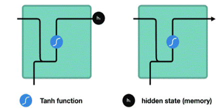
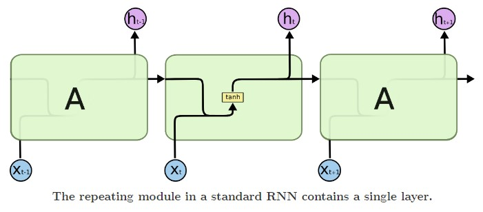
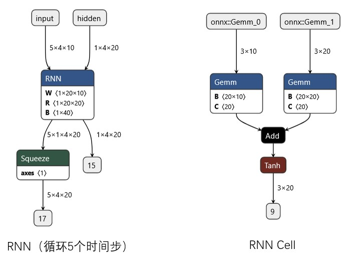
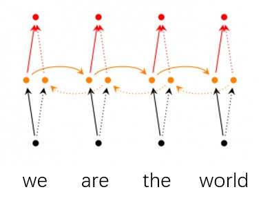

# 0 循环神经网络(Recurrent neural network：RNN)
&nbsp;&nbsp;&nbsp;&nbsp;&nbsp;&nbsp;&nbsp;&nbsp;循环神经网络(RNN)是前馈神经网络在处理序列数据时的一种**自然推广**。 

&nbsp;&nbsp;&nbsp;&nbsp;&nbsp;&nbsp;&nbsp;&nbsp;就像卷积网络是专门用于处理网格化数据（如一个图像）的神经网络，图像被视为独立的个体，彼此之间没有连续性。而对于一些有明显的上下文特征的序列化输入，如完形填空，句子翻译，那么很明显这样的输出必须依赖以前的输入， 也就是说网络必须拥有一定的**记忆能力**。 

&nbsp;&nbsp;&nbsp;&nbsp;&nbsp;&nbsp;&nbsp;&nbsp;为了赋予网络这样的 记忆力，一种特殊结构的神经网络——递归神经网络(Recurrent Neural  Network)便应运而生了。 

# 2 典型的RNN网络
&nbsp;&nbsp;&nbsp;&nbsp;&nbsp;&nbsp;&nbsp;&nbsp;RNNs之所以称为循环神经网路，核心在于一个序列当前的输出与前面的输出也有关, 或者下一时刻的输出要依赖于上一时刻的输出，其典型结构如下图所示： 

&nbsp;&nbsp;&nbsp;&nbsp;&nbsp;&nbsp;&nbsp;&nbsp;网络会对前面的信息进行记忆并应用于当前输出的计算中，即隐藏层之间的节点不再无连接而是有连接的，并且隐藏层的输入不仅包括输入层的输出还包括上一时刻隐藏层的输出。 

# 3 RNN 结构详解
## 3.1 RNN 循环过程如下图所示： 

其中隐藏层会重复执行，每次执行我们习惯上称值为一个时间步。 

隐藏状态按照下图传递： 

## 3.2 按时间步展开如下： 
**动态图如下**

**静态图如下**

## 3.3 经典RNN的计算图如下： 

其中：
- $x_{t}$ 表示第t(t=1,2,3...t...）个时间步（step）的输入
- $s_{t} 为隐藏层的第t步的状态，它是网络的记忆单元
- $o_{t}$ 是第t步的输出

## 3.4 RNN具体计算公式为： 
$$s_{t} = \sigma(W^{sx}x_{t} + W^{hh}s_{t-a})$$
$$o_{t} = W^{oh}s_{t}$$

**思考：上式三个权重矩阵W每个时间步 是同一份数据吗？？？**

## 3.5 RNN 工程图展示：

**思考：每个时间步为何没有矩阵相乘呢？**

## 3.6 RNN可扩展到双向的情况，其结构如下： 

**思考：正向和反向用到权重是同一份数据吗???**
**思考：反向时句子顺序需要倒序吗？**
**思考：正反向的结果，如何组合在一起？？？**

## 3.7 RNN扩展到多层构成循环神经网络，结构如下：

# 4 RNN 应用案例(意图识别)

如上图所示：将句子逐时间步输入到RNN中，这个过程我们可以看到，输入**time**的时候，前面 **what** 的输出也产生了影响（隐藏层中有一半是黑色的）。前面所有的输入都对未来的输出产生了影响，大家可以看到圆形隐藏层中包含了前面所有的颜色。 

当我们判断意图的时候，只需要最后一层的输出**o5**，如下图所示： 

# 5 经典RNN 存在的问题
&nbsp;&nbsp;&nbsp;&nbsp;&nbsp;&nbsp;&nbsp;&nbsp;通过上面的例子，我们已经发现，短期的记忆影响较大（如橙色区域），但是长期的记忆影响就很小（如黑色和绿色区域），这就是 RNN 存在的短期记忆问题。 

- RNN 有短期记忆问题，无法处理很长的输入序列
- 训练 RNN 需要投入极大的成本

&nbsp;&nbsp;&nbsp;&nbsp;&nbsp;&nbsp;&nbsp;&nbsp;由于 RNN 的短期记忆问题，后来又出现了基于 RNN 的优化算法，LSTM 和 GRU就是典型代表。 

# 6 LSTM(Long Short-Term Memory) 长短期记忆网络
&nbsp;&nbsp;&nbsp;&nbsp;&nbsp;&nbsp;&nbsp;&nbsp;长短期记忆（英语：Long Short-Term Memory，LSTM）是一种时间循环神经网络（RNN），论文首次发表于1997年。由于独特的设计结构，LSTM适合于处理和预测时间序列中间隔和延迟非常长的重要事件。 

## 6.1 LSTM 整体结构
有三个不同的门来调节LSTM单元中的信息流。分别为：遗忘门，输入门和输出门。遗忘门决定了与先前步骤无关的内容。输入门决定从当前步骤开始添加哪些信息。输出门确定下一个隐藏状态的信息。 

# 10 参考链接
[参考文献1](http://colah.github.io/posts/2015-08-Understanding-LSTMs/)
[参考文献2](https://towardsdatascience.com/illustrated-guide-to-lstms-and-gru-s-a-step-by-step-explanation-44e9eb85bf21)
[参考文献3](https://towardsdatascience.com/animated-rnn-lstm-and-gru-ef124d06cf45)

[参考文献5](https://blog.csdn.net/rongsenmeng2835/article/details/107369507?spm=1001.2014.3001.5502)

